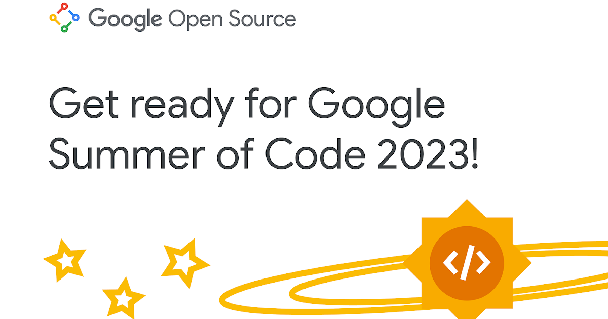
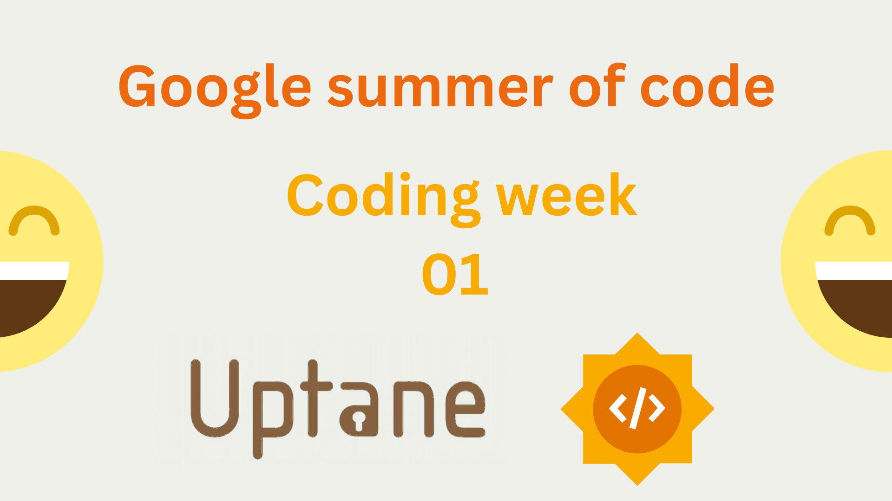

# Table of Contents

- [Introduction](#Introduction)
- [Selection Process](#selection-process)
- [About Uptane](#about-uptane)
- [Brief Intro to My Project](#brief-intro-to-my-project)
- [Community Bonding Period](#community-bonding-period)
- [Week 1 Task: Coding Phase](#week-1-task-coding-phase)
- [What's Next?](#whats-next)
- [Conclusion](#Conclusion)

# Introduction

Hi Everyone 👋

Welcome to the GSoC'23 Blogs Index 0! This is the first blog of a GSoC series where I'll be sharing my entire journey as a contributor and student developer, from day zero to the project's completion. I'm excited to have you join me on this adventure.

Before we delve into the details, let me first introduce myself, I'm Abhijay Jain, a computer science student from India currently pursuing B-Tech. My specialization lies in front-end development and web-related technologies. I have a keen interest in open-source projects and have collaborated with various organizations, such as Fossaisa, JBoss, Layer5, Mexili, P5.js-sound, Script Foundation, Open Horizon, SCoRe Labs, and EtherealEngine. In the spring of 2022, I had the opportunity to contribute to Open Horizon as an LFX mentee, I worked as a GSoC'22 student with SCoRe Lab, and currently, I'm contributing to Ethereal Engine as an XROS fellow'23, and now working with Uptane as a GSoC'23 student.

In this blog post, I'll share how my GSoC journey started, including the application process and my experiences during the community bonding period. I'll also provide an overview of my activities during the first week of the coding phase. Let's get started!

But why am I documenting this journey?

Good documentation is the key to effective collaboration. It provides a solid foundation for fostering innovation and driving progress. Not only does it serve as a valuable resource for reflection and learning, but it also helps us navigate through past experiences with clarity and relevance.

So let's talk about the selection progress and know little bit about GSoC as program as well.

# Selection Process: How I got selected

In March, GSoC announced the open-source organizations participating in the program on their website. These organizations are seeking developer and provide project details. Interested individuals then submit detailed proposals outlining their project plans before the April deadline. Mentors from participating organizations evaluate the proposals, and the selected contributors are announced in May. After the selection process, the official coding period begins.

Most of you are quite familiar with or heard about the overall selection process for Google Summer of Code. If you aren't, then don't worry, I will write a detailed post about the selection process in an upcoming blog.

Having been a GSoC student in the past, I was familiar with the process. However, this year, I wasn't sure if I would apply or not as I hadn't looked into projects extensively. I applied to [Uptane](https://github.com/uptane), a project I stumbled upon while reading about Linux Foundation projects. The project that caught my attention was called "Overhauling Uptane.io: Creating a Better User Experience for the Uptane Project Website." It involved revamping the current Uptane site, adding new features, and improving its overall appearance.

I applied to this project as I have previous experience with a similar tech stack and worked on documentation during my time in Open Horizon as an LFX mentee. I believe that this project could be impactful and provides an opportunity to create something that can be used as a resource by developers. If you want to read about the idealist in detail, you can refer to [here](https://wiki.linuxfoundation.org/gsoc/2023-gsoc-uptane).

Although I applied a little late, my mentor [Lois Anne DeLong](https://www.linkedin.com/in/lois-anne-delong-0706a128/) was incredibly supportive and helped me review my proposal. Despite the timing, I was fortunate enough to be selected for GSoC 2023 based on the quality of my proposal.

But before we delve into the details of my project, let's talk about the Uptane organization itself.

# About Uptane: A short brief

Uptane is an open and secure software update framework designed to protect software delivered over-the-air to automobile electronic control units (ECUs). This framework provides protection against malicious actors who can compromise servers and networks used to sign and deliver updates. Uptane is integrated into Automotive Grade Linux, an open-source system used by many large OEMs, and has been adopted by several U.S. and international manufacturers.

Uptane was created in 2016 through a collaboration between NYU, UMTRI, SwRI, and automotive industry experts. It uses the basic design principles of TUF, which is used in many production software update systems.

According to Wikipedia, "Uptane is a Linux Foundation / Joint Development Foundation hosted software framework designed to ensure that valid, current software updates are installed in adversarial environments. It establishes a process of checks and balances on these electronic control units (ECUs) to ensure the authenticity of incoming software updates. Uptane is designed for 'compromise-resilience,' limiting the impact of a compromised repository, insider attacks, leaked signing keys, or similar attacks. It can be incorporated into most existing software update technologies, offering particular support for over-the-air programming or OTA programming strategies."

Now, let's get into a brief introduction to my GSoC'23 project.

# Brief Intro: Overhauling Uptane

My GSoC'23 project involves enhancing the documentation website for Uptane. The main objective is to make the site more user-friendly, visually appealing, and accessible. By improving the documentation and the overall user experience, we aim to encourage wider adoption of Uptane and ensure a smooth onboarding process for developers and contributors.

The project's website serves as the primary source of information for users and developers, and it's essential that the information be easily accessible and understandable. However, the current website lacks organization and intuitive navigation, which could potentially discourage new users from adopting the system. Therefore, the goal of my project is to create a better user experience through improved organization and navigation.

After carefully reading and understanding the project's requirements and proposed ideas, I prepared my proposal accordingly. The proposal covered the project objectives, goals, proposed ideas, deliverables, and more. It also explored alternate approaches, such as using different frameworks like Docusaurus, if necessary.

If you're interested in reading my full proposal in detail, you can find it [here](https://drive.google.com/file/d/1lTvrFoS7VzOsNRWsmoHVOnTd0ui9BZ3g/view?usp=sharing).

Once the selected contributors were announced in May, we entered the community bonding period, which allowed us to establish connections with our mentors and get familiar with the organization.

# Community Bonding: Mentor Meeting & Task Breakdown Finalization

After being selected for GSoC, the community bonding period began in May. This phase allows GSoC contributors to establish connections with their mentors and get familiar with the organization. During the community bonding period, I had the pleasure of connecting with my mentor, Lois, and other members of the Uptane community. Our initial call played a vital role in establishing a strong foundation for our collaboration. We discussed various important aspects, including:

- Meeting Schedule: We established a regular meeting schedule that suited everyone involved. This ensured consistent communication throughout the project.
- Priorities: We identified key tasks that needed to becompleted and established their order of importance. This helped us prioritize our work and stay on track.
- Project Timeline: To ensure alignment with the GSoC review dates, we created a rough timeline that outlined the project's deadlines and milestones. This provided us with a clear roadmap to follow.
- Engaging the Uptane Community: We explored different ways to engage with the larger Uptane community, such as participating in online exchanges, contributing to blog posts, and more. This ensured that our work had a wider impact and fostered collaboration within the community.

One of the significant outcomes of our meeting was the decision to evaluate the use of Jekyll versus Docusaurus for revamping the site. After considering various factors and insights from mentors like Philip, Ira, Justin, and Andre, we concluded that Docusaurus would be the ideal choice. However, before fully committing to Docusaurus, we needed to ensure its compatibility with the existing Uptane documentation and address web accessibility concerns.

With our tasks and objectives defined, my mentor assigned me the initial task of creating a demo version of the site using Docusaurus. This basic version aimed to test the compatibility of the existing Uptane documentation with Docusaurus. I set up Docusaurus locally and migrated the Uptane docs to the new environment. Most of the markdown files seamlessly integrated with Docusaurus, requiring minimal adjustments. The demo version serves as a starting point for further enhancements.

After a week of the community bonding period, the official coding phase began on May 29th.

# Week 1 Task: Coding Phase (from May 29th onwards) | Initializing the project

During the first week of the coding phase, my primary task was to work on the demo version of the site. The goal was to determine if the existing Uptane docs are compatible with Docusaurus or if we should consider sticking with Jekyll, as discussed in our initial community call. I set up Docusaurus locally and migrated the Uptane docs to this new environment. The current state of the site is still quite basic, consisting of boilerplate code provided by Docusaurus along with the existing Uptane docs.

For creating the demo version of the site, I referred to the official documentation of Docusaurus (refer: <https://docusaurus.io/docs>).

To break down this task in simple words, I tested the existing markdown files present in the current repo <https://github.com/uptane/uptane.github.io> with the boilerplate code of Docusaurus and made sure if it is compatible or not.

While most of the markdown files integrated smoothly with Docusaurus, requiring minimal adjustments, there is still work to be done to enhance the overall functionality and design of the site.

Docusaurus boilerplate code provides a project folder structure for managing docs, blogs, src file (like CSS or pages). It also contains a Docusaurus.config file which allows developers to configure Docusaurus according to their needs.

If you're curious to see the progress made so far and experience the demo version of the site, feel free to check it out [here](https://abhijay007.github.io/uptane-demo/). Keep in mind that the demo version may contain broken links or incomplete markdown files. To address this issue, we plan to implement a workflow that identifies broken links or orphan pages, ensuring that the documentation remains relevant and users encounter fewer 404 errors.

I shared the demo version of the site with my mentors, along with the code repository (currently private). After careful consideration, we collectively decided to proceed with Docusaurus as it offers ease of maintenance, utilizes the latest technologies, and provides a more accessible and user-friendly experience. Moreover, Docusaurus allows us to build an ecosystem by integrating various modern tools, which would be challenging with Jekyll.

# What's Next?

During our second community call, we discussed the tasks for the second week. In our call, we focused specifically on the design aspect of the site after the demo version. I suggested that all mentors visit the website <https://docusaurus.io/showcase> to gather inspiration from existing sites regarding navigation, hero sections, footers, and other content. By sharing your valuable suggestions, we can collectively create compelling designs. Our goal is to achieve an attractive landing page before the first evaluation to make our site more presentable and engaging.

One of the mentors, Jon, shared crucial points regarding getting Docusaurus working with a multi-instance build. He mentioned that the deployment considerations are present in a separate repository. It would be great if we could directly fetch the deployment considerations from that repository and set up CI/CD pipelines for both deployment and pull requests.

To summarize the tasks for the upcoming weeks:

- Create a compelling design incorporating mentor feedback.
- Find a way to make Docusaurus work with a multi-instance build and set up CI/CD pipelines accordingly.

In addition to these tasks, we have an Uptane workshop scheduled for June 23\. As a GSoC contributor, I am grateful for the opportunity to present my GSoC project in front of the Uptane community. During this presentation, I will provide an overview of the project, discuss what we aim to achieve, and share the progress made up until the workshop.

# Conclusion

In conclusion, the journey of GSoC'23 has begun, and I'm thrilled to share my experiences as a contributor and student developer with all of you. This blog marks the beginning of a series where I'll be documenting my entire journey, from day zero to the completion of the Uptane documentation website project.

Stay tuned for the upcoming blog posts, where I'll be sharing more about the development process, milestones, challenges faced, and the exciting enhancements we make to the Uptane documentation website.

Thank you for joining me on this incredible journey, and I look forward to sharing more updates with you soon!
