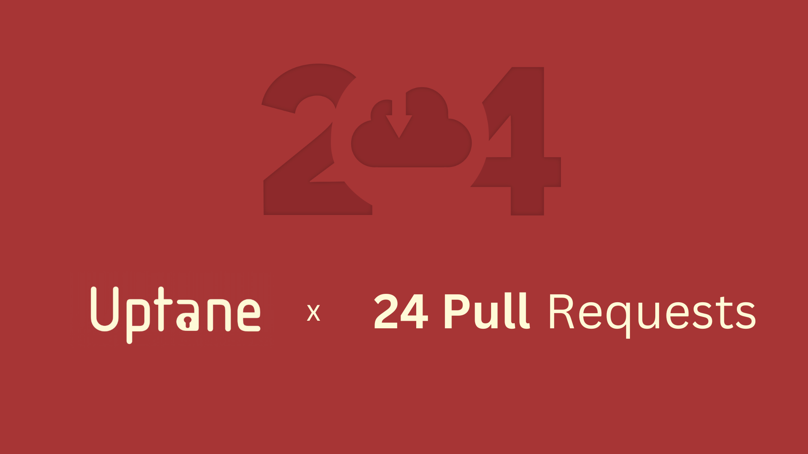

As winter approaches, [Uptane](https://uptane.org/) is thrilled to announce its participation in the annual 24 Pull Requests event! Joining this initiative is a testament to our  project's continuing commitment to collaboration and community building.

## 🤝 About Uptane:

Uptane is a robust framework designed to fortify the security of software updates within the automotive industry. It  addresses the growing need for a reliable solution that can ensure the safety and integrity of software updates for vehicles.

## 🎁 24 Pull Requests:

The [24 Pull Requests](https://24pullrequests.com/) event is an annual community-organized celebration in which developers are invited to contribute to open source projects over the holiday season. Join us in spreading the joy of collaboration by submitting 24 pull requests between December 1 and December 24.

## 🚀 How You Can Contribute:

Uptane welcomes developers from around the globe 🌍 to be a part of this exciting opportunity. Whether you're a seasoned contributor or someone eager to make their first open-source contribution, there's a place for you in the Uptane community. The emphasis on collaboration is at the core of Uptane's values, and we can't wait to review and merge your pull requests!

## 📆 Mark Your Calendar:

Save the dates between December 1 and December 24 for 24 Pull Requests. The [24 Pull Requests web-app/website](https://24pullrequests.com/) offers information about the event, project details, and a calendar to visualize your contributions.

Let's come together, share our knowledge, and make a positive impact on the future of automotive software. Fork the Uptane repository, submit your pull requests, and let's make this holiday season a season of giving in the open-source spirit! 🎄🛠️

Cheers to secure software updates, collaborative coding, and a festive season of open source! 🎉☕
