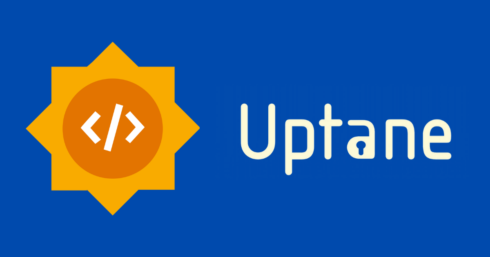

## Introduction

Greetings, fellow developers and enthusiasts! I'm Abhijay Jain, and I'm thrilled to share the incredible journey of my Google Summer of Code (GSoC) project with Uptane. In this blog, I'll walk you through the key aspects of my project, the challenges faced, the milestones achieved, and the exciting future prospects for serving its community.

## Student Info 🧑‍🎓

Before we dive into the details, let me reintroduce myself:

- **Name:** Abhijay Jain
- **Email:** Abhijay007j@gmail.com
- **GitHub Profile:** [https://github.com/Abhijay007](https://github.com/Abhijay007)
- **Medium:** [https://medium.com/@abhijay007j](https://medium.com/@abhijay007j)
- **LinkedIn:** [https://www.linkedin.com/in/abhijay-jain-551b01193/](https://www.linkedin.com/in/abhijay-jain-551b01193/)

## 📙 Abstract

Uptane is an important project that provides secure software updates for connected vehicles, and it needs to offer a better experience to its users to encourage the adoption of the technology. The project's website is the primary source of information for users and developers, and it's essential that the information is easy to access and understand. The current website has a lot of information; however, it's not well-organized. It's difficult for new users to find the essential information they need. The navigation through the site is also challenging. All of these factors could discourage new users from learning more about the project. The goal of this project is to overhaul the Uptane.io website to create a better user experience through more logical organization and easier navigation.

## :email: Communication during the development period

Before GSoC, contributors communicated with each other either through GitHub discussions or asynchronously via email. Since GSoC needed more regular discussion (more on a personal level), we decided to have bi-weekly meetings to have seamless communication and better understanding. For text conversations, we stuck to email as it is a feasible option for text-based communication. After every meeting, I used to write a follow-up email to the mentors so that we could have a backup or a routine outline of things we have discussed in those bi-weekly meetings.

One of our very first follow-up emails.

## 📝 About the project

The objective of this project is to deconstruct the current website layout and design and create a more logical arrangement of information. We aim to achieve this by:

- Improving the existing platform and overall design of the website, including typeface and color choices, to create a cleaner, more contemporary look.
- Reorganizing the content to make it easier for users to find the information they need to consider before adopting or integrating the Uptane project.
- Identifying key information that may be missing and adding it to the website.
- Adding dynamic elements to the website to support more interactivity between users and the site.

(PS: Here’s [the link](https://drive.google.com/file/d/1lTvrFoS7VzOsNRWsmoHVOnTd0ui9BZ3g/view?usp=sharing) to my GSoC proposal if you’re interested!)

### Initialization 🚀

During our first meeting, we needed to make an important decision: whether to stick with the existing technology, which is Jekyll, or migrate the site to a new framework, Docusaurus. After a discussion, we decided to go with Docusaurus as it is quite easy to maintain and comparatively better than Jekyll. The mentors assigned me the task of testing the existing content of the site with Docusaurus so that we can determine if using this program would be feasible. So, I created a demo version of the site and shared it with the mentors. After review, both the mentors and other community members reviewed our decision to go with Docusaurus as our main framework to build the site. The mentors then suggested that I move forward and prepare a new design layout for the site.

### New Site Layou 📐

I initiated the design of the new site by adopting a collaborative approach to receive continuous feedback. For efficient communication and design collaboration, I opted to use Figma, a tool with which I had prior experience. Figma served its purpose effectively. Lois shared a rough design doc [linked here](https://docs.google.com/document/d/1v4-tHH6dUWi-32H2qkBufHrZTsxzjHWGVHJGO9p0i34/edit?usp=sharing) explaining what we need on the new site, following which I started gathering design inspiration and shared a preliminary rough layout on Figma. I explored various platforms such as Dribbble and Behance. After conducting research, I stumbled upon a valuable resource: the Docusaurus showcase, which contained a collection of open-source sites built with Docusaurus. Drawing inspiration from these sites, I began working on the site's layout. I created a preliminary design that can be viewed below

- Link to the Figma Design File : [Figma Design](https://www.figma.com/file/drCXCmIbIiTq9yaSgQJQtF/uptane-New?type=design&node-id=0%3A1&mode=design&t=3oGmlYrO4UafXxjz-1).

| Figma Design Preview                                                                                                |
| ------------------------------------------------------------------------------------------------------------------- |
|  |

- Here is a video overview of the site, where I explained all the sections

<video controls width="100%">
  <source src= "https://github.com/Abhijay007/Uptane-GSoC-Report/assets/64387054/0deb8aec-1c25-44e3-bf00-897f78c2a9f3" />
</video>

### Coding the Site 💻

Once we had finalized the site's design to a significant extent, I embarked on the coding phase. Initially, I set up the existing site with Docusaurus boilerplate code to establish a starting point for development. Subsequently, I started coding individual components step by step, commencing with the home page and gradually extending to other sections. Throughout the development process, we engaged in iterative discussions and improvements to existing components. Some components that were initially included were reevaluated, and their significance was reconsidered, leading to a few additions and removals. Upon completion of the final layout, we proceeded with populating the site with documentation content and refining the existing codebase.

### Content Improvements 📄

After completing the initial deployment and layout of the site, we shifted our focus to enhancing the content, which serves as the documentation for the Uptane community. In the existing site, we encountered several content-related issues. Firstly, there was an abundance of unnecessary content including a number of redundancies across the site, and secondly, some of the existing content was outdated and required substantial improvements.

In the new site, we undertook a comprehensive overhaul of the documentation structure and redefined the hierarchy. This restructuring presented us with some challenges, especially when dealing with content originally structured for the old Jekyll architecture. We needed to adapt this content to the Docusaurus-based Markdown format. Docusaurus treats Markdown files somewhat differently and provides helpful tools for managing content effectively.

Some content on the site is fetched from different repositories. Initially, we contemplated establishing a workflow to handle this content, but over time, we realized that we could optimize the process by making edits to the existing workflows and ensuring that the updated content adheres to Docusaurus standards and best practices.

For details on the specific commits related to these content improvements, please refer to [this link](https://github.com/Abhijay007/uptane-demo/commits/master).

## Important Links 🔗

For those curious minds, here are essential links to explore:

- [GSoC Project Page](https://summerofcode.withgoogle.com/programs/2023/projects/QDCxHcPz)
- [GSoC Project Proposal](https://drive.google.com/file/d/1lTvrFoS7VzOsNRWsmoHVOnTd0ui9BZ3g/view?usp=sharing)
- [GitHub Organization Repo](https://github.com/uptane/uptane.github.io)
- [GitHub Personal Repo](https://github.com/Abhijay007/Abhijay007.github.io)
- [GitHub Project Demo Repo](https://github.com/Abhijay007/uptane-demo)
- [Commits during GSoC 2023](https://github.com/Abhijay007/uptane-demo/commits/master) in Demo Repo
- [Commits during GSoC 2023](https://github.com/uptane/uptane.github.io/commits?author=Abhijay007) in Main Repo - UptaneDocusaurus Branch
- [Website DEMO Deployed Version](https://abhijay007.github.io/uptane-demo/)
- [Website Live Deployed Version](https://uptane.github.io/)

## Interactions with the Uptane Community 🤝

I had the privilege of presenting myself and my GSoC project to the Uptane community at an Uptane workshop on June 23rd. During this presentation, I introduced myself and provided an overview of my GSoC project. Initially, I felt a bit nervous, and there were moments of hesitation during my presentation. However, the Uptane community and my mentors were incredibly supportive, and my efforts seemed to be appreciated.

I received valuable assistance from Lois in preparing the initial presentation, and she also provided timely reviews, which greatly contributed to the success of my presentation. This experience was entirely new to me, and it was an excellent opportunity to interact with members of the Uptane community, many of whom are highly accomplished in their respective fields. Presenting my work in front of such a distinguished audience was both a valuable experience and a unique opportunity for me. I am grateful to all the GSoC mentors who granted me this chance to showcase my work to the community.

If you would like to access the presentation slides, you can find them [here](https://drive.google.com/file/d/1jYN-EElUadChukSOIngqY4T5HhmHs7eA/view?usp=sharing).

## :star: Acknowledgements 🙏

My journey through Google Summer of Code has been a remarkable experience as it represented a transition from personal projects to contributing to real-world website applications. The opportunity to learn by doing has been invaluable, and I am deeply grateful to have been part of this extraordinary program ❤️.

I extend my heartfelt gratitude to all the mentors who have been an incredible source of guidance and support throughout my GSoC journey. Your mentorship has been instrumental in my growth as a developer, and I am fortunate to have had you by my side every step of the way.

I want to express my appreciation to all the mentors, including Lois, Philip, Ira, Jon, Justin, and the dedicated members of the community. Your unwavering support and willingness to assist have been invaluable. The regular check-in meetings, understanding of contributors' needs, and effective program structuring were all testaments to your dedication. You maintained open lines of communication through emails, which facilitated the sharing of progress and concerns. I couldn't have asked for better mentors; you have truly made my GSoC journey special and enriched my experience.

To the reader who has made it this far, I want to express my gratitude. It's the support and recognition of fellow developers like you that make our efforts all the more rewarding. Thank you for being a part of this journey with me.

## What Was Covered ✔️

The project successfully achieved milestones, including migration to Docusaurus, documentation revision, redesigned website layout, enhanced design elements, addition of missing information, and integration of dynamic elements.

## What Work Remains 🚀

While most project milestones were met, exciting improvements lie ahead. Integration of site analytics, enhanced search functionality, introduction of new components, code and image optimization, and workflows for auto-updating content and PR previews are among the future prospects.

## Reference 📚

For those interested in diving deeper, here are references to explore:

- [Docusaurus Documentation](https://docusaurus.io/)
- [Docusaurus Showcase](https://docusaurus.io/showcase)
- [Figma](https://www.figma.com/files/recents-and-sharing?fuid=820735499407925327)
- [Uptane Site](https://uptane.github.io/)
- [React Documentation](https://reactjs.org/)

## Overall Experience 😄

To say the least, this has been a highly rewarding experience. I extend my most sincere gratitude to Google for running such a great and extremely inclusive program, Google Summer of Code has been a great opportunity for me. I learned new technical concepts every day and it has made me a stronger software developer today. I had a wonderful time interacting with the amazing folks at Uptane and especially it has been an absolute pleasure working with my mentors. They have been constantly guiding and helping me throughout this journey, undoubtedly the best mentors anyone could ever ask for!

Truly an experience I will cherish for a lifetime!

## 🔄 Would like to sync? 📞

- We are keeping all the communications open, so that everyone can sync and is free to contribute. So if you have any feature/bugs suggestions about anything please do not hesitate to open up an issue in the Uptane Projects.

- You can join Uptane's mailing list to participate in the discussions happening here : [uptane-standards@googlegroups.com](mailto:uptane-standards@googlegroups.com). Additionally, you can connect with the Uptane community on [Discord](https://discord.gg/uWyT6gDCqx), or stay updated on the latest announcements by following Uptane on [LinkedIn](https://www.linkedin.com/company/uptane/).
