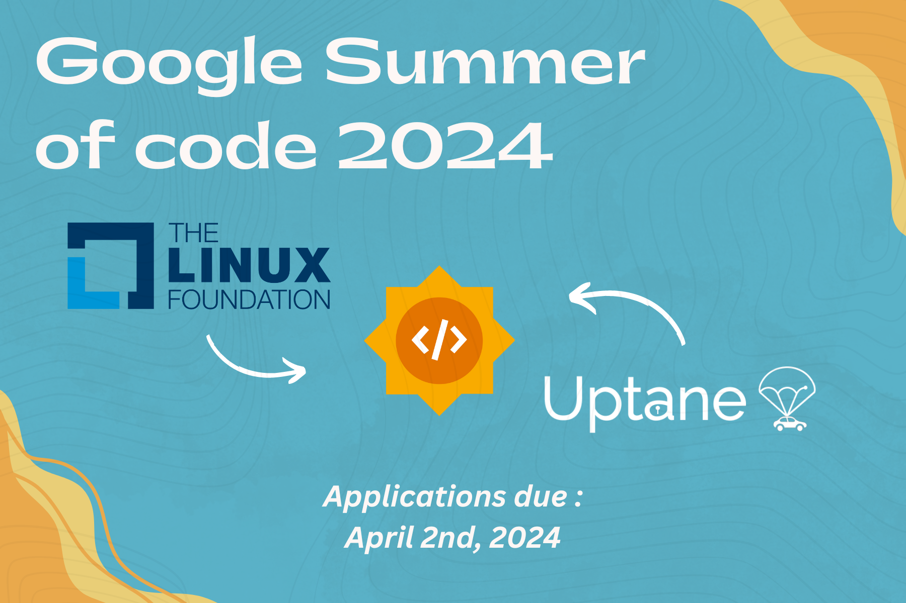

Greetings, Uptane community! 👋

We are thrilled to announce that Uptane's sponsoring organization, the Linux Foundation,  has officially become a part of the 2024 edition of Google Summer of Code (GSoC). This will mark Uptane's third year of mentoring GSoC projects under the Linux Foundation umbrella and we couldn't be more excited about the opportunities it presents. 🎉

At its core, GSoC represents more than just a mentoring program; it's a gateway to welcome and engage new contributors to the realm of open source software. It embodies the spirit of giving back, of investing a small portion of time to make a monumental difference, not only in the future endeavors of the GSoC contributors, but also for the broader Uptane community that will reap benefits of these collaborations. 🌟

We extend a warm welcome to all new GSoC contributors willing to join the Uptane community as mentees. We believe that this experience will not only enhance your technical skills but also provide valuable insights into the workings of our community. The highlight lies in the opportunity to learn from individuals who are not only passionate about the Uptane ecosystem but also deeply committed to making a positive impact on others' lives, be it GSoC contributors or the project at large. 🤝

## Here We Come: What’s Next? 🚀

With GSoC now officially announced, we anticipate a surge in potential contributors reaching out to projects through our [Discord](https://discord.gg/SUNJ3gjm9j) channel. In the coming weeks, our focus will be on assisting these participants in finding projects that align with their interests, exploring relevant domains, and refining their project proposals before the April 2nd deadline (UTC). Subsequently, we will meticulously review applications, select projects, and assemble mentor teams to facilitate the process. 🔍

For detailed information about available project ideas, please refer to our [blog](https://uptane.org/blog/2024/01/12/callForIdeas).

**How Do I Apply?** 📝

We urge interested participants to engage with the Uptane community early on, try to join our weekly and bi-weekly Uptane standard meetings, and become active members of our Discord server to stay informed about upcoming events and discussions. Doing this will help you to get a better understanding of the projects and the Uptane community, which will be very beneficial while choosing projects and preparing your proposals.

Although the application period officially commences on March 18th (UTC), we advise candidates to commence preparations without delay. Utilize this time to refine project proposals, familiarize yourselves with Uptane, and delve deeper into your proposed areas of study. Detailed project descriptions are available here on The Linux Foundation's official [idealist](https://wiki.linuxfoundation.org/gsoc/2024-gsoc-uptane), and our mentors are preparing resources to aid contributors in their initial exploration.

## Important Dates for GSoC 2024 📅

- February 22 - March 17: Potential GSoC contributors discuss application ideas with mentoring organizations.
- March 18: GSoC contributor application period begins.
- April 2: GSoC contributor application deadline.
- May 1: Accepted GSoC contributor projects announced.
- May 1 - 26: Community Bonding Period.
- May 27: Coding officially begins!
- July 8: Midterm evaluation.
- August 26 - September 2: Mentors submit final GSoC contributor evaluations (standard coding period).
- September 3: Initial results of Google Summer of Code 2024 announced.
- September 3 - November 4: GSoC contributors with extended timelines continue coding.
- November 4: Final date for all GSoC contributors to submit their work product and final evaluation.
- November 11: Final date for mentors to submit evaluations for GSoC contributor projects with extended deadlines.

For further details, please refer to the [GSoC Timeline](https://developers.google.com/open-source/gsoc/timeline).

## Join the Discussion 🗣️

If you have any doubts and want to discuss something or want resources, don't forget to join our [Discord server](https://discord.gg/SUNJ3gjm9j). We have a dedicated channel for GSoC named [#gsoc](https://discord.gg/jJrCAzTxtp) to answer your doubts.

Let's make Uptane GSoC 2024 ☀️ a collaborative success 🚀!

We are incredibly excited to embark on this journey with the GSoC community, fostering collaboration, innovation, and growth within the Uptane ecosystem. Together, let's make GSoC 2024 a resounding success! 🌱

Stay tuned for more updates and exciting developments. 📣
