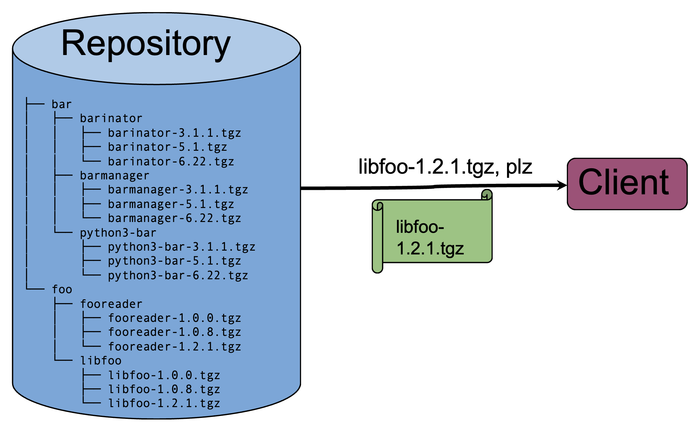
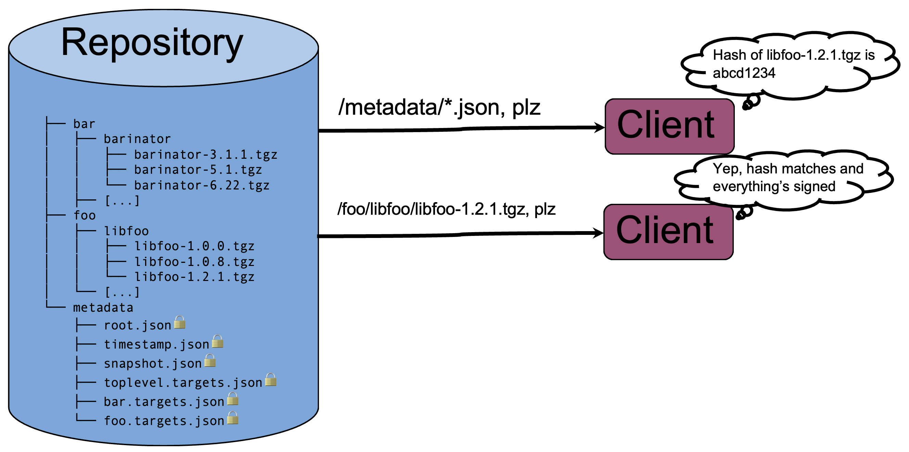
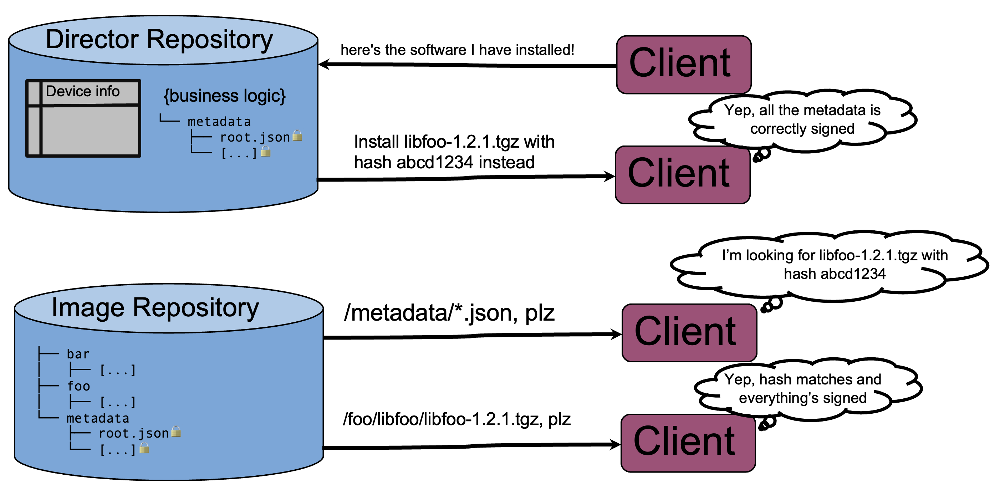

Let me get this out of the way right at the start: Today, Uptane can be an intimidating project to get involved with. Why is that? Well, first of all, Uptane is a standard, not a specific piece of software. That in itself is always difficult; it's harder to engage with an abstract set of rules and concepts than it is to engage with a real piece of software. But even beyond that, Uptane is a little bit different from some other standards you might read. It doesn't specify the exact wireline formats and metadata schema that must be implemented. Furthermore, Uptane kind of sits "in the middle" on a software update architecture diagram.

In this post, I want to do three things: first, I'm going to answer the question "Why should I want to use Uptane, and where?" Second, I'm going to give a really high-level overview of what Uptane is. I'm not going to get into specifics _how_ Uptane works, I just want to describe what it is, and what it does. And finally, I want to show the easiest way to start using a system that delivers software updates using Uptane, making use of open-source implementations of various parts of an Uptane system.

## Why should I use Uptane?

Uptane isn't just for vehicles!

Uptane was designed as a system to safely and securely deliver software updates to vehicles. That means it needs to work under some difficult constraints: there are dozens of different microcontrollers inside a vehicle, all running software that might need to be updated, connected by a number of different buses. There are challenging regulatory requirements, as well: a vehicle might only be road-legal with certain approved firmwares running on safety-critical parts. So you need to make sure that vehicles can report the software they're running in a verifiable way, and you need to be able to control the complete set of software and firmware running on the vehicle.

These factors make Uptane a really good choice for many other kinds of software updates to embedded devices. Medical devices, industrial automation, robotics, and other fields can also benefit from using an Uptane system. The rule of thumb you should use is this: if end users will be making choices about the firmware on the device that go beyond choosing if/when to install the latest updates, you probably want "basic" TUF. If the devices should be controlled more centrally, with the manufacturer (or some other entity) choosing when software updates should be delivered, you should use Uptane.

## What is Uptane?

Uptane is a standard: a set of rules to follow that will make your software update system resilient to a wide variety of real-world, long-term attacks. Uptane has various implementations, most of them proprietary, many of them confidential and inside automotive companies. But to understand what it _is_, the best thing will be to show some diagrams.

This is a software repository, and a device that connects to it and installs an update. (I'm going to just say "device" for the purposes of this article. It might be a vehicle, or a robot, or an MRI machine.)

Let's say the repository is just an FTP server. It has some firmware images in it, in some kind of predictable directory structure. To make the repository more secure, you can follow the TUF standard. TUF describes how to add some signed metadata to a "standard" software repository like this, to make it possible for anyone who connects to the repository to verify a number of important properties related to timeliness, authenticity, and consistency. A TUF-compliant client can verify that:

* The owner of the repository decided which packages to let in
* The publisher of each package signed their own software and uploaded it
* The versions of the packages I see here are actually the latest ones, or at least they're out of date by no more than some known amount of time
* The hash of every binary/firmware image on the repository can be independently checked and verified, in an automated way
* None of the keys used for signing software have been revoked
* ...and a number of other things; the overall threat model that TUF protects against is too large for a bullet-point list

This is great, and is enough for securing traditional package repositories, where the end user knows what to install--think PyPI, npm, apt, or Cargo. It also allows the publisher to remove packages from the repo, and prevent them from being installed--for example, if a version was discovered to have a serious bug, you can simply remove it from the repository to prevent people from installing it. (Compare this to signing each release package with, say, a GPG key that users store in their keyring: if you want prevent naïve users/clients from installing a particular version, you have to also revoke the key used to sign it, and try to make sure that the revocation is propagated. Not an easy task, which is why it's so rarely done.) Let's look at our picture now:

But we need a bit more than this. Our clients are embedded devices or vehicles: we don't want to just give them a list of every possible package that exists and let them sort out what to install. We need to actually give them instructions about what to install, and we also need to know what's currently installed on them. This is where Uptane comes in. Uptane builds on TUF, adding a second entity called the Director repository. The director repository is responsible for, well, _directing_ the devices to install the software they're supposed to have installed, via whatever internal business logic is required. It also processes and validates the manifests that the devices send, so it's a reliable source of truth for what software is currently installed. Again, I'm not going to get into detail about how it does this; for now it's enough to know _what_ it does. 

So, once you have a director repository, an image repository, and a device, the picture is complete. In broad strokes, the protocol for checking for an update goes like this:

That's more or less it. Of course, there are many, many details. The bulk of the standard relates to the exact procedures for how the device checks the metadata and signatures. And of course, we've ignored the question of how software gets into a repository, how the signing keys are managed, and how Director decides what should be installed on the device. Uptane also deals with "secondaries", meaning that one internet-connected microcontroller or embedded linux device can download and validate firmware updates for other microcontrollers; you can read elsewhere about how secondaries work.

### What Uptane Isn't

If you've gotten to this point, you've probably realized that there is a significant amount of stuff missing from the picture. Uptane doesn't say anything about:

* an interface to manage the software in the repository
* how to keep track of the information Director gets from the devices
* how Director decides what software the device should have installed
* how the device actually installs the update
* how the device authenticates itself to the repository
* transport security between the repository and the device (though Uptane is resilient to transport security compromise)

So there's a lot of other stuff that you need to attach Uptane concepts to before you have a complete update system. Some of those things might be relatively easy, some harder, but there are certainly a lot of them.

The reason Uptane was created this way is that it was written to solve real problems with existing systems. TUF was created as a way for existing software repositories to improve their security; those repositories already had systems for developers to register their package names and upload their software, and clients that know how to install the packages. Uptane was created to be used by automakers who already have software repositories, suppliers sending them firmware, quality control processes for what constitutes a software release, aftersales and maintenance departments keeping track of what parts might need software updates, and so on. It's a standard that answers the question, "How can I make my existing, complex system safer?" It would also make the standard very bloated and very inflexible if we made arbitrary decisions about those auxiliary pieces; we want the Uptane standard to remain focused on solving supply-chain security and software deployment security.

But what if you are coming at it from the opposite direction? You don't already have a big complex system to secure, and you just want to set up a software repository and deliver software updates to embedded devices, using best practices from the start? In short, now that you know what Uptane is and what Uptane isn't, how can you actually use it?

## Ways to use Uptane Today

So, for a full Uptane system, you need:

* An image repository, with some APIs/interfaces for doing common things
* A director repository, with some way to create software updates and assign them to devices
* A client on your device that can talk to your server, and install updates

There are actually pretty easy options for all of these things, including both free-as-in-beer and free-as-in-speech resources.

### Servers/repositories

* [OTA Community Edition](https://github.com/uptane/ota-community-edition/)

OTA Community Edition is the open-source, community-maintained Uptane implementation. It implements an image repository, director repository, and a device registry to keep track of the manifests (and other information) the devices send. It has HTTP REST APIs for all of the basic necessities for Uptane, but also for the practical bits that you need, like actually assigning updates to devices, uploading software, generating keys, and so on.

The OTA Community edition repository contains instructions for how to spin up the services on a local network; to run an adequate production instance you'll need to fill in some blanks. It doesn't currently have a well-maintained web UI, but it's still possible to use the UI that was previously developed and open-sourced by HERE Technologies, once you make a few modifications to stub out API calls to their proprietary services. (P.S.: If you're interested in contributing to Uptane, developing a community-maintained web UI for OTA Community Edition is one of the [project proposals we're interested in](https://wiki.linuxfoundation.org/gsoc/2024-gsoc-uptane) for [Google Summer of Code 2024](https://summerofcode.withgoogle.com/)!)

* [app.uptanedemo.org](http://app.uptanedemo.org)

I've spun up an instance of OTA Community Edition to help people get their feet wet, for free. It's open to the public as a demo instance, with all of its private signing keys published publicly (so, buyer beware: if you connect a device to this instance, anyone who wanted to could install malicious software). I wipe and reset it periodically. Some documentation on how to use it is coming soon, but for now, just pop into discord and ask if you'd like to connect a device to it.

* [Torizon Cloud](https://www.torizon.io)

Torizon Cloud is a service provided by Toradex, built around Uptane. You can make a limited-usage account for free; if you go beyond 10 devices you have to pay. Disclosure: I work for Toradex on the team that develops Torizon Cloud, so this is self-promotion. The service is primarily geared at people running Toradex's embedded linux distro Torizon OS, but it is a perfectly normal Uptane server that you can use with any of the client options below.

* Other commercial Uptane providers

There are other commercial providers of Uptane services, including Airbiquity's OTAMatic, HERE's OTA Connect, and CAROTA's Remote Updates. However, there don't appear to be open-source offerings of any of the parts, or demo servers that can be accessed without a commercial contract. (If anyone from those companies wants to reach out and correct me on that, I'm happy to add a link.)

### Clients

* Build your own using [libaktualizr](https://github.com/uptane/aktualizr/)

The main way to get an Uptane client is to build one using [libaktualizr](https://github.com/uptane/aktualizr/). The aktualizr repository does include reference clients that can talk to OTA Community Edition servers. However, to really make use of Uptane and aktualizr, you'll want it to be integrated in your embedded linux build.

* Add aktualizr to your existing embedded Linux using [meta-updater](https://github.com/uptane/meta-updater/)

Most people building embedded linuxes these days use Yocto. You can use meta-updater to integrate aktualizr into your Yocto build. There will be some work to do if you want to use it with an unsupported board; in particular you'll need to integrate OSTree and your bootloader, to deploy the images.

* Use [Torizon OS](https://www.torizon.io/) or [Common Torizon](https://github.com/commontorizon/Documentation)

This is probably the easiest way to get started. Torizon OS is a linux distribution tailored for Toradex's embedded system-on-modules, so if you have Toradex hardware it's built right in. But even if you don't have a Toradex module, you can still use [Common Torizon](https://github.com/commontorizon/Documentation). It's a Toradex-sponsored and community-maintained port of [Torizon OS](https://www.torizon.io/) to non-Toradex hardware; you can install it on a [Raspberry Pi](https://github.com/commontorizon/Documentation/blob/main/FLASH-RPI.md) or even an [x86 machine or VM](https://github.com/commontorizon/Documentation/blob/main/FLASH-X86.md).

## Next steps

Hopefully this has been a good primer for getting started with the Uptane project! We're planning to release more blog posts in the near future digging a little bit deeper into aktualizr and OTA Community Edition, but if you have questions or topics you're interested in seeing on the Uptane blog, let us know. You can always [join our Discord](https://discord.gg/uWyT6gDCqx).