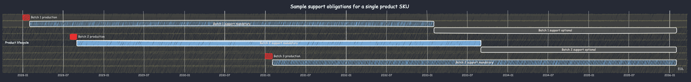

Uptane isn't just for automotive applications anymore. For a number of years now, we've seen adoption of Uptane in other sectors that have high security requirements, like robotics, civil infrastructure, and industrial automation. In the embedded Linux space, for example, [Torizon Cloud](https://www.torizon.io/) has been providing Uptane-as-a-service for IoT and industrial automation for years. Any domain where you want security, software/firmware updates to multiple independent compute units or components, reliable and secure software manifests, or secure offline updates is a good domain to implement Uptane in.

But I'm writing today about a major new piece of legislation from the European Union: the Cyber Resilience Act (CRA). It was adopted without changes [last week](https://www.consilium.europa.eu/en/press/press-releases/2024/10/10/cyber-resilience-act-council-adopts-new-law-on-security-requirements-for-digital-products/) by the Council of the EU, meaning it will enter into force very shortly--the remaining steps are merely procedural, such as publishing official translations in the EU's legislative journal. The CRA's requirements talk a lot about software updates, though, and it looks like Uptane is a perfect way to meet those requirements.

## What is the Cyber Resilience Act? Why now?

The Cyber Resilience Act is no joke: it imposes serious new cybersecurity requirements on any product with digital elements offered for sale anywhere in the European Union, and serious fines for any manufacturer (or importer) selling that don't comply. The EU looked at the landscape of cybersecurity in IoT, consumer electronics, industrial control systems, and more, and found it to be seriously lacking. Devices get shipped with ancient firmwares rife with security holes, and never get patched. Those devices end up getting compromised by cyber-criminals, and causing trouble not just for the people who bought them, but for the whole world: botnets of [millions of compromised IoT devices](https://en.wikipedia.org/wiki/Mirai_(malware)) are one of the biggest vectors for DDOS attacks, for example.

But market forces don't do a great job of incentivizing good cybersecurity practices, unfortunately. The average consumer has no way to tell the difference between IoT products with good cybersecurity practices and bad ones, and it's a lot cheaper to _claim_ to be secure than to actually put in the work to be secure.

So what can be done when market forces are failing, and profit motives are causing negative externalities? Regulation, with steep penalties for bad actors. Selling products that turn into botnets because it's cheaper not to patch actively exploited security holes isn't all that different from dumping dangerous chemicals into a stream because it's cheaper than disposing of them properly. With the CRA's penalties of up to 2.5% of global annual revenue (or 15 million euros, whichever is higher), the profitability equation drastically changes.

The CRA has three main pillars. The first pillar is product-related essential requirements, the second is mandating continuing responsibility for handling security issues and vulnerabilities after the product is sold, and the third relates to properly informing end users about support periods and other important cybersecurity features. I'm going to look only at the first two pillars here.

A surprising portion of the new concrete requirements under the CRA relate to software updates. That shouldn't be a surprise to most cybersecurity professionals: exploits happen, and when they do, they need to be patched. The fact that so many connected devices ship without a software update system, or with an insecure or incomplete software update system, is the root cause of a lot of problems. For those reasons, some of the CRA's most detailed and specific requirements relate to software updates.

## Uptane and the CRA: A natural fit

So, we have a major new regulation that mandates broad adoption of over-the-air software update systems. Uptane was developed to be a secure over-the-air software update system against an incredibly strong threat model; one of the talks that Prof. Cappos would often give in the early years of Uptane was entitled [Securing Over-the-Air Updates Against Nation State Actors](https://ossalsjp18.sched.com/event/EaXX/securing-over-the-air-updates-against-nation-state-actors-justin-cappos-nyu). So it's not surprising that Uptane is a natural choice for meeting CRA obligations.

### Software update client requirements

Let's look at some of those concrete requirements. First off, software updates are absolutely mandatory:

> Products shall:
> * ensure that vulnerabilities can be addressed […] through automatic security updates that are enabled as a default setting

This requirement clearly indicates the need for an _active_ update system. It is not sufficient, for example, to publish a software update and notify the user that it's available. The product itself needs to be able to automatically check for and install security updates. But of course, automatic updates are themselves potentially a serious attack vector. But the CRA's framers understand the same thing that the automotive industry does: automatic updates are themselves an extremely dangerous attack vector. So it also prescribes that these updates need to be distributed securely:

> Products shall:
> * provide for mechanisms to securely distribute updates […] in an automatic manner

Here, and throughout the regulation, the CRA doesn't delve into specifics. EU-level regulation tends to be written in common-sense, plain language; the details of what it means for an mechanism of distributing updates to be secure is left up to the experts. But clearly, applying a known and established standard like Uptane is one of the best ways to ensure compliance. Software update security isn't an easy problem, and many high-profile, real-world software update systems have had major compromises over the years. Rolling your own update system is usually a bad idea.

### Vulnerability monitoring and per-device requirements

The CRA mandates a _support period_ for every product of at least 5 years. During the support period, you are responsible for reviewing the security of the software on the product, and ensuring that any exploitable vulnerability of the product is patched without delay:

> Manufacturers of products with digital elements shall:
> * in relation to the risks posed to products with digital elements, address and remediate vulnerabilities without delay, including by providing security updates
> * apply effective and regular tests and reviews of the security of the product with digital elements

Obviously having a reliable, flexible, and secure software update system is a prerequisite for meeting these requirements. But there's another issue: under the CRA, you might have different support obligations for different products, even of the same SKU.

That's because the support period is defined by, and starts when, the product is [placed on the market](https://eur-lex.europa.eu/legal-content/EN/TXT/HTML/?uri=CELEX:52022XC0629(04)#d1e2095-1-1). If you follow that link, you'll see the detailed legal definition of what it means to be "placed on the market" in the European Union, but the crux of it is that (1) "placing on the market" is a concept that applies to individualized products, not SKUs or product lines, and (2) a product cannot be considered to be placed on the market before it is actually manufactured. That means that you may have different support obligations for different individual products of the same SKU:

One solution to this issue is simply to extend support to all products of a particular SKU until 5 years after the last one is manufactured. But if that's not feasible or desirable, you need a way to accurately determine when your support obligations for each product expire. Uptane's signed software manifests provide this: every time a device checks for an update, it sends a manifest. In that manifest, there is a report generated and cryptographically signed by each component of the device detailing exactly what software/firmware it has installed, identified by the software/firmware's hash.

This is perfect for tracking support obligations! Even though your product tracking needs might not be as detailed as an automaker's, leveraging Uptane's built-in reporting mechanism can still help you do compliance tracking. The fact that the reports also tell you exactly what software the devices in the field are running is just an added bonus. The software manifests also let you can keep track of how many devices successfully upgrade when run an update campaign, and will also alert you if malicious software is installed or software is unexpectedly downgraded.

## Final thoughts

The Cyber Resilience Act is here, and it brings meaningful new requirements. Uptane can help you meet quite a lot of them, because many of the things the CRA requires were already core requirements for Uptane back when we started designing it in 2015. I'm personally very happy to see these principles make it into law and regulations, because I firmly believe that keeping devices up to date with regular software updates is one of the most effective ways to increase cybersecurity for everyone. But at the same time, automatic software update systems are extremely dangerous if they aren't implemented properly. So I very much encourage any device manufacturer that finds itself suddenly in need of an automatic update system to look first at an Uptane-based one. You can implement Uptane yourself, or you can use existing implementations. There are free-as-in-beer, free-as-in-speech, and SaaS offerings available. I already gave a run-down of the various options in [my last blog post](https://uptane.org/blog/2024/02/26/Get-Started-With-Uptane#serversrepositories), so I won't repeat myself here. (Full disclosure: I am paid to work on [Torizon Cloud](https://www.torizon.io/), an Uptane-based SaaS offering.)

To offer a slight spin on an [old proverb](https://english.stackexchange.com/questions/603690/origins-of-the-phrase-the-best-time-to-plant-a-tree-was-30-years-ago-the-secon): the best time to integrate an Uptane software update system was at the beginning of your product design process. The second best time is today.