## Uptane Deployment Best Practices v.2.0.0

## 1 Introduction

Uptane is a standard, and does not have an official distribution or implementation. We do provide a [reference implementation in Python](https://github.com/uptane/uptane), and there are a number of open source projects such as [aktualizr](https://github.com/advancedtelematic/aktualizr), [rust-tuf](https://github.com/heartsucker/rust-tuf), [Notary](https://github.com/theupdateframework/notary), and [OTA Community Edition](https://github.com/advancedtelematic/ota-community-edition/) implementing all or part of the Standard. In addition, commercial Uptane offerings are available in the marketplace from [HERE Technologies](https://www.here.com/products/automotive/ota-technology) and [Airbiquity](https://www.airbiquity.com/product-offerings/software-and-data-management).

However, in any serious Uptane installation, a number of deployment decisions will need to be made, and policies and practices for software signing and key management will need to be implemented. Additionally, some OEMs may wish to develop their own Uptane implementation. Here, we provide a set of best practices for how to set up, operate, integrate, and adapt Uptane to work in a variety of situations. We also discuss the human operations required, and describe Uptane-compatible ways to implement some specific features that OEMs have requested guidance or clarification on in the past.

All of these guidelines should be viewed as complementary to the official Uptane Standard: they should be taken as advice, not gospel.

In addition, these guidelines may be used in the creation of [POUFs](https://github.com/uptane/poufs). POUFs contain the Protocols, Operations, Usage, and Formats of an Uptane implementation. These details can be used to design interoperable Uptane implementations.

## 2 Preparing an ECU for Uptane

At the highest level, the basic requirement for an ECU to be capable of supporting Uptane is that it be able to perform either full or partial verification, and access a secure source of time. (See the [Uptane Standard](https://uptane.github.io/uptane-standard/uptane-standard.html#build-time-prerequisite-requirements-for-ecus) for official requirements.)

To bootstrap an Uptane-capable ECU, a few things need to be provisioned into the unit:

- **A current set of Uptane metadata**, so that the ECU is able to verify the first set of metadata it gets from the server. The exact metadata files required depend on whether the ECU performs full or partial verification. Full verification ECUs need a complete set of metadata from both repositories, while partial verification ECUs only need the Targets metadata from the Director repository.
- **A secure way to know what time it is**, so the ECU cannot be tricked into accepting expired metadata. The ECU must receive a fairly recent time as soon as it is powered on (or reset to factory settings) to prevent the possibility of freeze attacks.
- **ECU key(s)**, to sign the ECU’s [version reports](https://uptane.github.io/papers/uptane-standard.1.1.0.html#version_report), and optionally to decrypt images. These signing keys should be unique to the ECU, and the public keys will need to be stored in the Director repository’s inventory database.
- **Information about repository locations**, generally in the form of a [repository mapping file](https://uptane.github.io/papers/uptane-standard.1.1.0.html#repo_mapping_meta). This is a metadata file that tells the ECU the URIs of the repositories (if it is a Primary ECU), as well as which images should be fetched from which repository. (Images that are encrypted or customized per-device would generally come from the Director repository, and all others from the Image repository.)

## 2.1 ECU implementation choices

There are three big decisions to make about each Uptane ECU: first, whether it will perform full or partial verification, second, whether it will use an asymmetric or symmetric ECU key, and third, whether it will use encrypted or unencrypted update images. Here, we offer some advice on making those choices.

### 2.1.1 Full vs. partial verification

Uptane is designed with automotive requirements in mind, and one of the difficulties in that space is that ECUs requiring OTA updates might have very slow and or memory-limited microcontrollers. To accommodate those ECUs, Uptane includes the option of partial verification. So, how do you choose between full and partial verification for a particular ECU?

Firstly, if the ECU is a Primary ECU, partial verification is not an option. Primaries need to perform full verification. For other ECUs, full verification is preferable when possible, for at least two reasons:

1.  Full verification is more secure. Because they do not check Image repository metadata, partial verification ECUs could be instructed to install malicious software by an attacker in possession of the Director repository’s Targets key (and, of course, a way to send traffic on the relevant in-vehicle bus).
2.  Full verification ECUs can rotate keys. As partial verification is designed for ECUs that can only reasonably check a single signature, they do not download or process Root metadata, which is the mechanism for revoking and rotating signing keys for all other metadata, a partial verification ECU has no truly secure way to invalidate a signing key.

Partial verification ECUs are expected to have the Root and Targets metadata present at the time of manufacturing or installation in the vehicle. To update the Root metadata, the ECU SHOULD install a new image containing the metadata. To update the Targets metadata, the ECU SHOULD follow the steps described in the [Uptane Standard](https://uptane.github.io/papers/uptane-standard.1.1.0.html#partial_verification). Partial verification Secondaries MAY additionally fetch and check metadata from other roles or the Image repository if the ECU is powerful enough to process them, and the implementer wishes to take advantage of their respective security benefits.

### 2.1.2 Symmetric vs. asymmetric ECU keys

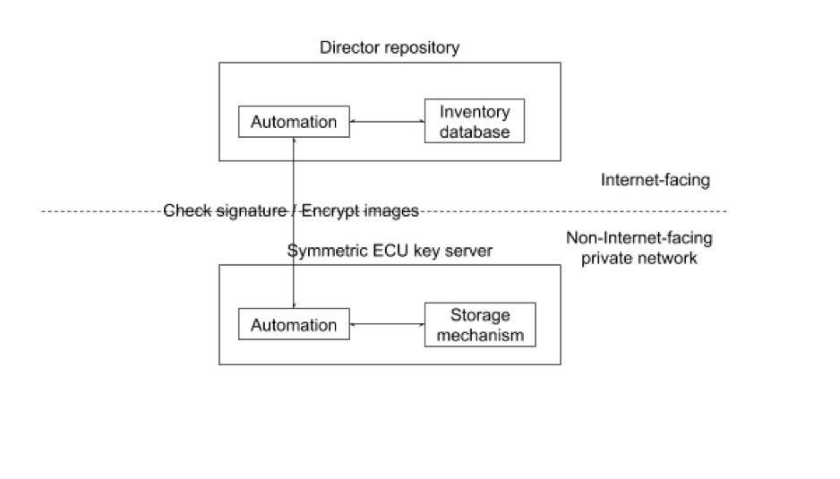

**Figure 1.** _An arrangement that an OEM SHOULD use when using symmetric ECU keys._

ECUs are permitted to use either symmetric or asymmetric keys. This choice is effectively a performance vs. security trade-off. Symmetric keys allow for faster cryptographic operations, but expose a larger attack surface because the Director will need online access to the key. Asymmetric ECU keys are not affected by this problem, because the Director only needs access to the ECU’s public key.

Basically, choosing symmetric keys increases the performance of the common case (checking signatures and decrypting images), but makes disaster recovery harder, because a compromised key server could require updating ECU keys on every vehicle.

#### 2.1.2.1 Symmetric key server

If you choose to use symmetric ECU keys, it would be a good idea to store the keys on an isolated, separate key server, rather than in the inventory database. This separate key server can then expose only two very simple operations to the Director:

1.  Check the signature on an ECU version report.
2.  Given an ECU identifier and an image identifier, encrypt the image for that ECU.

Unencrypted images should be loaded onto the symmetric key server by some out-of-band physical channel (for example, via USB stick).

### 2.1.3 Encryption of images on ECUs

The Director repository may encrypt images if required (see [Section 5.3.2](https://uptane.github.io/papers/uptane-standard.1.1.0.html#director_repository) of the Uptane Standard). However, no Uptane implementation should support interactive requests from an ECU for encryption. Allowing the Target ECU to explicitly request an encrypted image at download time would not only increase the attack surface, but could also be used to turn off encryption. This would make it easy for attackers to reverse engineer unencrypted firmware and steal intellectual property. Only the OEM and its suppliers should determine policy on encrypting particular binaries, and this policy should be configured for use by the Director repository, rather than being toggled by the Target ECU.

## 2.2 ECUs without filesystems

Currently, implementation instructions are written with the implicit assumptions that: (1) ECUs are able to parse the string filenames of metadata and images, and that (2) ECUs may have filesystems to read and write these files. However, not all ECUs, especially partial verification Secondaries, may fit these assumptions. There are two important observations:

First, filenames need not be strings. Even if there is no explicit notion of “files” on an ECU, it is important for distinct pieces of metadata and images to have distinct names. This is needed for Primaries to perform full verification on behalf of Secondaries, which entails comparing the metadata for different images for different Secondaries. Either strings or numbers may be used to refer to distinct metadata and images, as long as different _files_ have different _file_ names or numbers. The Image and Director repositories can continue to use filesystems, and may also use either strings or numbers to represent _file_ names.

Second, ECUs need not have a filesystem in order to use Uptane. It is only important that ECUs are able to recognize distinct metadata and images by using either strings or numbers as _file_ names or numbers, and that they can allocate different parts of storage to different _files_.

## 2.3 ECUs without secondary storage

As described in the [Standard](https://uptane.github.io/papers/uptane-standard.1.1.0.html#send_metadata_primary), all Secondaries MUST store some metadata objects. For partial verification Secondaries, this MAY include only the Targets metadata from the Director repository. If an ECU does not have any or enough secondary storage to store even just that one object, then it cannot be considered an Uptane Secondary. However, such a non-Uptane ECU can still be updated within an Uptane system, albeit with weaker guarantees than for fully-supported ECUs. In this case, the Director and Primary would treat a non-Uptane ECU like any other Secondary, but the ECU will not be able to perform any verification for itself. It must rely entirely on the Primary’s verification of the metadata and images.

## 3 Setting up Uptane repositories

This section outlines recommended procedures for the one-time operations that an OEM and its suppliers SHOULD perform when they set up Uptane for the first time. In particular, they SHOULD correctly configure the Director and Image repositories, and make sure they have access to a secure source of time, so that the impact of a repository/server compromise is as limited as possible.

## 3.1 Secure source of time

Without access to a secure source of time, ECUs may be prevented from receiving the most recent updates. If the ECU’s time is set too far ahead, it will determine that the current valid metadata is expired and thus be unable to perform an update. If the ECU’s time is set too far behind, an attacker can freeze or replay old metadata to the ECU. (ECUs in Uptane will not accept an earlier time than what has previously been seen and signed with the same key.)

If a Primary ECU does not have a secure clock, then that Primary ECU SHALL use some other secure external means to acquire accurate time. If a Secondary ECU does not have a secure clock, then the ECU SHALL use the time messages from its Primary ECU to acquire accurate time. The following subsection describes how time servers can be used in an Uptane implementation.

### 3.1.1 External sources of time

The IETF Network Time Protocol v4 [NTPv4, RFC 5905](https://datatracker.ietf.org/doc/rfc5905) with IETF Network Time Security for the Network Time Protocol [NTS for NTP, RFC 8915](https://datatracker.ietf.org/doc/html/rfc8915) SHOULD be used by an ECU to acquire accurate time. If IETF NTPv4 (or a higher version) is used, then that ECU SHALL conform to IETF Network Time Protocol Best Current Practices [BCP 223 / RFC 8633](https://datatracker.ietf.org/doc/rfc8633/). If IETF NTPv4 (or higher version) is used, then that ECU SHALL discard any received NTP mode 6 and mode 7 packets to prevent a DDOS attack caused by an old (1989) NTP implementation bug described [here](http://blog.cloudflare.com/the-ddos-that-knocked-spamhaus-offline-and-ho) and [here](https://us-cert.cisa.gov/ncas/alerts/TA14-013A).

The work-in-progress [IETF Roughtime protocol](https://datatracker.ietf.org/doc/draft-ietf-ntp-roughtime/) and the [IETF Roughtime Ecosystem](https://datatracker.ietf.org/doc/draft-ietf-ntp-roughtime-ecosystem/) MAY be used by an ECU to acquire sufficiently accurate time to verify certificates (i.e., expiration) and signatures (i.e., freshness). Note that these are a revision and enhancement of the original [Google Roughtime](https://roughtime.googlesource.com/roughtime). See also the [Cloudflare implementation](https://github.com/cloudflare/roughtime).

The US Global Positioning System (GPS), originally Navstar GPS, SHOULD NOT be used as a secure time source by any Uptane ECU, because spoofing attacks against the unsecured, civilian GPS signals are common, as described [here](https://www.euractiv.com/section/defence-and-security/news/russia-responsible-for-massive-satellite-system-spoofing-study-finds/) and [here](https://rin.org.uk/blogpost/1706945/332376/What-is-spoofing-and-how-to-ensure-GPS-security). . #### Changes to the Director repository

If an external time source is in use, a representation of its public key is CONDITIONALLY REQUIRED in Director repository Root metadata.

If an external time source is implemented AND partial verification Secondaries are used, the following metadata is CONDITIONALLY REQUIRED in the Director repository’s Targets metadata:

- A representation of the public key(s) for the external time source, similar to the representation of public keys in Root metadata.

Listing the public key of the external time source in Director Targets metadata is necessary to allow partial verification Secondaries to perform key rotation.

#### 3.1.1.1 Changes to a Primary

If an external time source is implemented, the Primary SHOULD follow its stipulated procedure for verifying the time. This procedure occurs after the vehicle version manifest is sent and will fulfill the [Download and check current time](https://uptane.github.io/papers/uptane-standard.1.1.0.html#check_time_primary) step of the Uptane Standard.

If the response of the external time source meets verification criteria, update the Primary ECU’s clock and retain the time source response for distribution to Secondary ECUs. If it fails to meet this criteria, discard the response and continue the procedure without an updated time.

#### 3.1.1.2 ECU version report

The ECU version report from each Secondary may contain a token to be sent to the external time source in whatever manner the implementer chooses.

#### 3.1.1.3 Changes to all ECUs

After the vehicle has been assembled, ECUs MAY receive an attestation of the current time as downloaded from the external time source.

As the first step to verifying metadata, described in the Standard for both the [Primary](https://uptane.github.io/papers/uptane-standard.1.1.0.html#check_time_primary) and [Secondaries](https://uptane.github.io/papers/uptane-standard.1.1.0.html#verify_time), the ECU SHOULD load and verify the most recent time from the designated time source by following its designated procedure. This will likely include verifying that the signatures on the downloaded time are valid

If all steps are completed without error, the ECU SHOULD overwrite its current attested time with the time it has just downloaded.

If any check fails, the ECU SHOULD NOT overwrite its current attested time, but SHOULD jump to the last step ([Create and send version report](https://uptane.github.io/uptane-standard/uptane-standard.html#create_version_report))to report the error.

#### 3.1.1.4 Changes to check Root metadata

In order to prevent a new time source from accidentally causing a rollback warning, the clock will be reset as folllows: check the time source key after updating to the most recent Root metadata file. If the key is listed in the Root metadata has been rotated, reset the clock used to set the expiration of metadata to a minimal value (e.g., zero, or any time that is guaranteed to not be in the future based on other evidence). It will be updated in the next cycle.

#### 3.1.1.5 Changes to partial verification Secondaries

As partial verification Secondaries only check the Targets metadata from the Director repository, the time source keys on these ECUs will be checked when verifying the Targets metadata. To do this, check the key after verifying the most recent Targets metadata file. If the external time source key is listed in the Targets metadata and has been rotated, reset the clock used to determine the expiration of metadata to a minimal value as described above.

#### 3.1.1.6 Time source key compromise

In the event of a key compromise for an external time source, an attacker would be able to return a time attestation that contains an arbitrary time. The attacker could then either:

- Make all metadata appear to be expired. If the returned time is far in the future, the vehicle would interpret all Uptane metadata as expired. The vehicle would be unable to verify the metadata, thus creating a denial of service.
- Make expired metadata appear to be current. If the returned time is in the past, Uptane metadata that was valid at that point in the past will seem current to the vehicle, thus allowing for a freeze attack. This cannot be used for a rollback attack as the ECU will not accept a time earlier than the time of their previous update.

All of these attacks can be mitigated by rotating any key associated with an external time in Root metadata, as described in [Managing signing keys and metadata expiration](https://uptane.github.io/deployment-considerations/key_management.html).

## 3.2 What suppliers should do

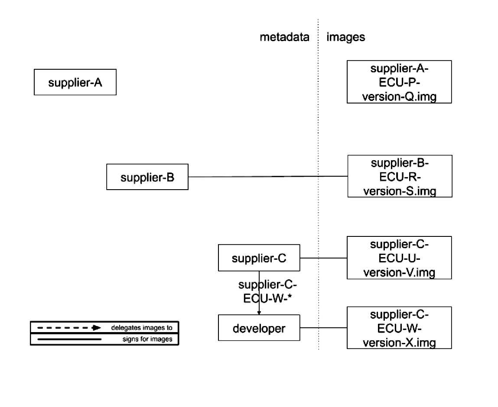

**Figure 1.** _Diagram showing supplier signing arrangements. Suppliers are free to ask the OEM to sign images on its behalf (supplier A), or can sign them itself (supplier B). In the latter case, it MAY also delegate some or all of this responsibility to others (supplier C)._

Either the OEM or a tier-1 supplier SHOULD sign for images for any ECUs produced by that supplier, so unsigned images are never installed. This provides security against arbitrary software attacks. An OEM will decide whether or not a tier-1 supplier SHOULD sign its own images. Otherwise, the OEM will sign images on behalf of the supplier, and the supplier SHOULD only deliver update images to the OEM as outlined under the \[Normal Operating Guidelines\] (https://uptane.github.io/deployment-considerations/normal_operation.html) section of this document. If the supplier signs its own images, it MUST first set up roles and metadata using the following steps:

1.  Generate a number of offline keys used to sign its metadata. In order to provide compromise resilience, these keys SHOULD NOT be accessible from the Image repository. The supplier SHOULD take great care to secure these keys, so a compromise affects some, but not all, of its ECUs. The supplier SHOULD use the threshold number of keys chosen by the OEM.
2.  Optionally, delegate images to members of its organization (such as its developers), or to tier-2 suppliers (who MAY further delegate to tier-3 suppliers). Delegatees SHOULD recursively follow these same steps.
3.  Set an expiration timestamp on its metadata using a duration prescribed by the OEM.
4.  Register its public keys with the OEM using some out-of-band mechanism (e.g., telephone calls or certified mail).
5.  Sign its metadata using the digital signature scheme chosen by the OEM.
6.  Send all metadata, including delegations, and associated images to the OEM.

A tier-1 supplier and its delegatees MAY use the [Uptane repository and supplier tools](https://github.com/uptane/uptane) to produce these signed metadata.

## 3.3 What the OEM should do

The OEM sets up and configures the Director and Image repositories. To host these backend services, the OEM MAY use its own private infrastructure, or cloud computing.

### 3.3.1 Director repository

_Note that all information about setting up signing keys for this repository can be found in the [Managing signing keys and metadata expiration](https://uptane.github.io/deployment-considerations/key_management.html) section of this document._

In order to provide on-demand customization of vehicles, the OEM SHALL also set up the Director repository following the guidance in the [Uptane Standard](https://uptane.github.io/papers/uptane-standard.1.1.0.html#director_repository). In addition, an OEM must keep in mind the following factors. Unlike the Image repository, the Director repository:

1.  is managed by automated processes
2.  uses online keys to sign Targets metadata
3.  does not delegate images
4.  generally provides different metadata to different Primaries
5.  MAY encrypt images per ECU, and
6.  produces new metadata on each request from a Primary.

**Steps to initialize the repository**

In order to initialize the repository, an OEM SHOULD perform the following steps:

1.  Set up the storage mechanism according to the directions for the chosen protocol. For example, the OEM might need to set up a ZFS filesystem.
2.  Set up the transport protocol, following the details of the chosen systems. For example, the OEM may need to set up an HTTP server with SSL/TLS enabled.
3.  Set up the private and public APIs to interact over the chosen transport protocol.
4.  Set up the Root, Timestamp, Snapshot, and Targets roles.
5.  If the Director will be serving per-device encrypted images, copy all relevant images from the Image repository.
6.  Initialize the inventory database with the information necessary for the Director repository to perform dependency resolution, or encrypt images per ECU. This information includes: (1) metadata about all available images for all ECUs on all vehicles, (2) dependencies and conflicts between images, and (3) ECU keys.
7.  Set up and run the automated process that communicates with Primaries.

The automated process MAY use the repository tools from our [Reference Implementation](https://github.com/uptane/uptane) to generate new metadata.

#### 3.3.1.1 Roles

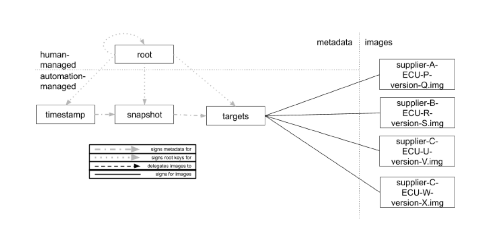

**Figure 2.** _A proposed configuration of roles on the Director repository._

Unlike the Image repository, the Director repository does not delegate images. Therefore, the Director repository SHOULD contain only the Root, Timestamp, Snapshot, and Targets roles, as illustrated in Figure 2. In the following subsections, we will discuss how metadata for each of these roles is produced.

#### 3.3.1.2 Private API to update images and the inventory database

An OEM SHOULD define a private API for the Director repository that is able to: (1) upload images, and (2) update the inventory database. This API is private in the sense that only the OEM should be able to perform these actions.

This API SHOULD require authentication, so that each user is allowed to access only certain information. The OEM is free to use any authentication method as long as it is suitably strong. Examples include [client certificates](https://docs.microsoft.com/en-us/archive/blogs/kaushal/client-certificates-vs-server-certificates), a password, or an API key encrypted over TLS. For additional security, the OEM may use [multi-factor authentication](https://en.wikipedia.org/wiki/Multi-factor_authentication) that utilizes more than one authentication method.

In order to allow automated processes on the Director repository to perform their respective functions, without also allowing any attackers who might compromise the repository to tamper with the inventory database, it is strongly RECOMMENDED that these processes should have some boundaries. That is, the automated processes SHOULD be able to read any record in the database and write new records, but SHOULD NOT be able to update or delete existing records.

#### 3.3.1.3 Public API to send updates

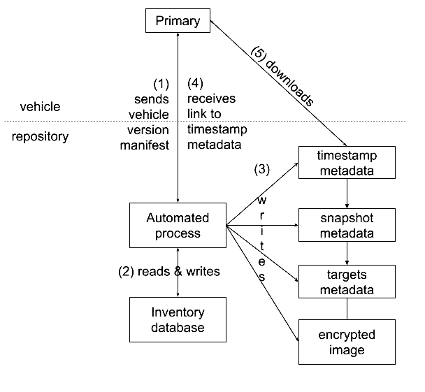

**Figure 3.** _How Primaries would interact with the Director repository._

An OEM SHOULD define a public API to the Director repository so that it is able to send updates to vehicles. This API can be designed to the wishes of the OEM, and can use either a push or pull model to send updates to Primaries. The difference between the models lies in whether or not a running vehicle can be told to immediately download an update (via a push), or can wait until a pull occurs.

Either way, the OEM can control how often updates are released to vehicles. In the push model, the OEM can send an update to a vehicle whenever it likes, as long as the vehicle is online. In the pull model, the OEM can configure the frequency at which Primaries pull updates. In most realistic cases, there will be little practical difference between the two models.

There is also no significant difference between these methods when it comes to resistance to denial-of-service (DoS) attacks or flash crowds. In the push model, a vehicle can control how often updates are pushed to it, so that vehicles can withstand DoS attacks, even if the repository has been compromised. In the pull model, the repository can similarly stipulate when vehicles SHOULD download updates, and how often.

Regardless of what model is used to send updates, as illustrated in Figure 4, the API SHOULD allow a Primary to: \* send a vehicle version manifest (step 1) \* download associated metadata and image files (step 4).

The API MAY require authentication, depending on the OEM’s requirements.

#### 3.3.1.4 Sending an update

Sending an update from the Director repository to a Primary requires the following five steps, as shown in Figure 3.

1.  The Primary sends its latest vehicle version manifest to the Director repository via an automated process.
2.  The automated process performs a dependency resolution. It reads associated information about this vehicle, such as ECU identifiers and keys, from the inventory database. It checks that the signatures on the manifest are correct, and adds the manifest to the inventory database. Then, using the given manifest, it computes which images SHOULD be installed next by these ECUs. It SHOULD record the results of this computation on the inventory database so there is a record of what was chosen for installation. If there is an error at any point of this step, due to incorrect signatures, or anything unusual about the set of updates installed on the vehicle, then the Director repository SHOULD also record it, so the OEM can be alerted to a potential risk. Repository administrators MAY then take manual steps to correct the problem, such as instructing the vehicle owner to visit the nearest dealership.
3.  Using the results of the dependency resolution, the automated process signs fresh Timestamp, Snapshot, and Targets metadata about the images that SHOULD be installed next by these ECUs. Optionally, if the OEM requires it, it MAY encrypt images per ECU, and write them to its storage mechanism. If there are no images to be installed or updated, then the Targets metadata SHOULD contain an empty set of targets.
4.  The Primary downloads the metadata and image files.

Since the automated process is continually producing new metadata files (and, possibly, encrypted images), these files SHOULD be deleted as soon as Primaries have consumed them, so that storage space can be reclaimed. This MAY be done by simply tracking whether Primaries have successfully downloaded these files within a reasonable amount of time.

### 3.3.2 Image repository

_Note that all information about setting up signing keys for this repository can be found in the [Managing signing keys and metadata expiration](https://uptane.github.io/deployment-considerations/key_management.html) section of this document._

Finally, in order to provide compromise resilience, the OEM MUST set up the [Image repository](https://uptane.github.io/papers/uptane-standard.1.1.0.html#image-repository) following the guidance in the Uptane Standard. The Image repository differs from the Director repository in a number of ways. First, it is managed by human administrators who use offline keys to sign Targets metadata. It also MAY delegate images to suppliers, and it provides the same metadata to all Primaries. Lastly, it does not encrypt images per ECU, and it updates its metadata and images relatively infrequently (e.g., every two weeks or monthly).

**Steps to initialize the repository**

In order to initialize the repository, an OEM SHOULD perform the following steps. Note that, as with the Director repository, all users are expected to follow basic set up instructions, as well as the specific set up instructions mandated by the users’ choices of storage mechanisms and protocols. 1. Set up the storage mechanism. 2. Set up the transport protocol. 3. Set up the private and public APIs to interact over the chosen transport protocol. 4. Set up the Root, Timestamp, Snapshot, and Targets roles. 5. Sign delegations from the Targets role to all tier-1 supplier roles. The public keys of tier-1 suppliers SHOULD be verified using some out-of-band mechanism (e.g., telephone calls or certified mail), so that the OEM can double-check their authenticity and integrity. 6. Upload metadata and images from all delegated Targets roles (including tier-1 suppliers). Verify the metadata and images, and add them to the storage mechanism.

An OEM and its suppliers MAY use the repository and supplier tools from the [Reference Implementation](https://github.com/uptane/uptane) to produce new metadata.

#### 3.3.2.1 Roles

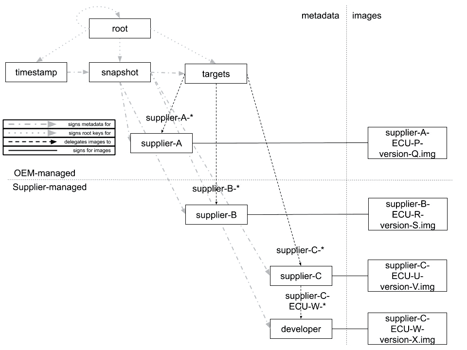

**Figure 4.** _A proposed configuration of roles on the Image repository._

Using delegations allows the OEM to: (1) control which roles sign for which images, (2) control precisely which Targets metadata vehicles need to download, and (3) distribute, revoke, and replace public keys used to verify Targets metadata, and hence, images. In order to set up delegations, an OEM and its suppliers MAY use the configuration of roles illustrated in Figure 4. There are two important points.

- The OEM maintains the Root, Timestamp, Snapshot, and Targets roles, with the Targets role delegating images to their respective tier-1 suppliers.
- There SHOULD be a delegated Targets role for every tier-1 supplier, so that the OEM can:
  - limit the impact of a key compromise.
  - precisely control which Targets metadata vehicles need to download.

The metadata for each tier-1 supplier MAY be signed by the OEM (e.g., supplier A), or the supplier itself (e.g., suppliers B and C). In turn, a tier-1 supplier MAY delegate images to members of its organization, such as supplier C who has delegated a subset of its images to one of its developers, or to its tier-2 suppliers who MAY delegate further to tier-3 suppliers.

Every delegation SHOULD be prefixed with the unique name of a tier-1 supplier, so that the filenames of images do not conflict with each other. Other than this constraint, a tier-1 supplier is free to name its images however it likes. For example, it MAY use the convention “supplier-X-ECU-Y-version-Z.img” to denote an image produced by supplier X, for ECU model Y, and with a version number Z.

#### 3.3.2.2 Public API to download files

An OEM SHOULD define a public API for Primaries to use when downloading metadata and images to the Image repository. This API can be defined in whatever manner the OEM wishes.

Depending on the OEM’s requirements, this API MAY require authentication before Primaries are allowed to download updates. Such a choice affects only how certain the OEM can be that it is communicating with authentic Primaries, and not how resilient ECUs are to a repository compromise. The OEM is free to use any authentication method.

#### 3.3.2.3 Using images from multiple locations

Uptane implementations may sometimes need to accommodate update systems where existing software comes from several different locations. Implementers may assume that this would mandate the use of multiple different Image repositories in any equivalent Uptane implementation. However, this is rarely necessary, and using multiple Image repositories (implemented via [repository mapping metadata as described in TAP-4](https://github.com/theupdateframework/taps/blob/master/tap4.md)) would require a significantly larger effort.

In almost all cases, it is preferable to have a single Image repository containing all of the Uptane metadata, and redirect clients to download the actual images from other locations. This can be implemented via an API on the Image repository, or via a custom field in the Targets metadata directing the clients to one or more alternate URL where the images are available.

An API solution could be as simple as an HTTP 3xx redirect to the appropriate download location. More complex schemes, e.g., cases where existing legacy repositories have a custom authentication scheme, can usually be implemented by adding custom metadata. See the [relevant section of the Standard](https://uptane.github.io/uptane-standard/uptane-standard.html#custom-metadata-about-images) for more information on how custom metadata can be added.

## 3.4 Specifying wireline formats

In setting up an Uptane system, an implementer will need to specify how information, such as metadata files and vehicle version manifests, should be encoded. As a guiding principle of the Uptane framework is to give each implementer as much design flexibility as possible, the Uptane Standard does not specify particular data binding formats. Instead, OEMs and suppliers can continue to use the protocols and formats of existing update systems, or they can select formats that best ensure interoperability with other essential technologies.

To facilitate coordination between implementations, an Uptane adopter can choose to write a POUF, an added layer to the Standard in which an implementer can specify choices of Protocols, Operations, Usage and Formats. A POUF provides an easy way for an implementer to specify the elements that can ensure interoperability. It can also be customized for the special needs of fleet owners in a particular industry, such as taxis, car sharing networks, police forces, or the military.

Information on writing a POUF can be found on the [POUF Purpose and Guidelines](https://uptane.github.io/pouf.html) page of the Uptane website. A sample POUF, written for the [Uptane Reference Implementation](https://uptane.github.io/reference_pouf.html), offers sample metadata written in [ASN.1/DER](https://github.com/uptane/uptane.github.io/blob/master/reference_pouf.md#file-formats).

## 3.5 Cost considerations

There is no short answer to the question of what it costs to implement Uptane because such a decision involves a number of variables, starting with how to plan an implementation. An OEM with an existing OTA system has two methods to implement Uptane: either buy an off-the-shelf solution and integrate with it, or build a custom solution, with some greater or smaller degree of reliance on available open-source client and server components. If a project is starting from scratch, there is a third option: Uptane could be integrated from the start, beginning with the design stage. In that case, the cost of implementing Uptane itself would be minimal, and may even represent a cost reduction, as it provides a framework for organizing the analysis and development that must be undertaken regardless.

If a user is contemplating options one or two, the relative costs are admittedly more difficult to estimate. When considering off-the-shelf products, an Uptane solution may be more or less expensive than other OTA solutions, but Uptane itself may not be the primary cost driver. There is also the possibility that the goals of the provider and the OEM could be misaligned, which can make integration difficult and likely expensive. Lastly, there is always a risk profile associated with outsourcing an OTA system to a third party, as the supplier could go out of business or decide to phase out the product in the wake of a shift in corporate priority.

A variant of the custom in-house option may be a safer choice for larger OEMs, but it can also come with a high price tag and require substantial effort to integrate. In any case, when upgrading from a legacy solution, a risk assessment of the current solution and evaluation of the current weaknesses and opportunities for improvement will be necessary. Uptane provides an organized framework for this assessment, which could help to reduce costs compared to an assessment without such a framework. The costs of the upgrade itself are dependent upon the individual needs, security concerns, and existing infrastructure of the implementer.

Ultimately, the issue of cost cannot be decided without also estimating the value received for that expense. Value in this case is enhanced security, so when discussing costs, the trade-off between taking shortcuts and sacrificing security, or doing it right and spending more time and money, must be considered. For example, robust key rotation is one of the most important pillars of TUF and Uptane, but it is also something that users may be prepared to ignore if they think it will save money. Therefore, before thinking about cost, potential implementers should do a risk assessment of the current solution, evaluate its weaknesses, and identify the major opportunities for improvement. Only by knowing the risks they are defending against can implementers legitimately assess if the cost is an investment in the security of their project and their company, rather than just another expense eating away at profits.

## 4 Managing signing keys and metadata expiration

This section addresses both setup and maintenance issues for the signing keys used by Uptane. These include understanding the function of online vs. offline keys, the use of signing thresholds to improve security, and the management of metadata expiration dates.

## 4.1 Normative references

The secure management of cryptographic key material has been well-documented in previous studies. Implementers of Uptane SHOULD follow best practices outlined in [IETF RFC 4107](https://tools.ietf.org/html/rfc4107) / [BCP 107](https://tools.ietf.org/html/bcp107) - Guidelines for Cryptographic Key Management.

## 4.2 Repository keys

On both the Director and the Image repository, the OEM maintains the keys to the Root, Timestamp, Snapshot, and Targets roles. However, for any delegated Targets roles on the Image repository, the corresponding keys are expected to be maintained by the supplier to which the corresponding images have been delegated. For example, if a tier-1 supplier signs its own images, then the supplier would maintain its own (ideally offline) keys.

### 4.2.1 Online vs. offline keys

Repository administrators SHOULD use offline keys to sign the Root metadata on the Director repository, so attackers cannot tamper with this file after a repository compromise. The Timestamp, Snapshot, and Targets metadata SHOULD be signed using online keys, so that an automated process can instantly generate fresh metadata.

On the Image repository, there are two options for signing the Timestamp and Snapshot metadata, each with the opposite trade-off from the other. In the first option, the OEM uses online keys, meaning automated processes for renewing the Timestamp and Snapshot metadata when new Targets metadata and/or images are available. With this option, fresh metadata can be instantly generated by the automated process. On the other hand, if attackers compromise a supplier’s key as well as the Image repository, they could instantly publish malicious images. If these attackers also compromise the Director repository, then they can execute arbitrary software attacks by selecting these malicious images on the Image repository for installation. Such an attack could also facilitate mix-and-match attacks.

In the second option, the OEM uses offline keys to sign Timestamp and Snapshot metadata, which reduces the risk of attackers immediately publishing malicious images. Here again, though, there is a trade-off, in this case related to the metadata expiration dates. If the Timestamp and Snapshot metadata expire relatively quickly, then it may be cumbersome to use offline keys to renew their signatures. Yet, if a longer expiration time is used, it would give a man-in-the-middle attacker more time to execute freeze attacks, hence defeating the purpose of the Timestamp role.

For most use cases, the online option may be best, but if stronger security guarantees are desired, consider using the offline option instead for the Timestamp and Snapshot roles.

The keys to all other roles (Root, Targets, and all delegations, which includes suppliers’ keys) on the Image repository SHOULD be kept offline to prevent a repository compromise from immediately affecting full verification ECUs. It is also a practical decision as these metadata are infrequently updated. It does not matter where an offline key is stored (e.g., in a Hardware Security Module, YubiKey, or a USB stick in a safe deposit box), as long as the key is not accessible from the repository. Each key SHOULD be kept separate from the others, so that a compromise of one does not affect them all.

### 4.2.2 Key thresholds

#### 4.2.2.1 Director repository

Since a compromise of the Root role keys would have the greatest impact on the Director repository, it SHOULD use a sufficiently large threshold number of keys. This ensures that a single key compromise does not allow that corrupted key to sign the Root metadata file on its own. Each key within the threshold MAY belong to a different repository administrator. For example, if there are 8 administrators, then at least 5 keys SHOULD be required to sign the Root metadata file, so that a quorum is required to trust the metadata.

The Timestamp, Snapshot, and Targets roles MAY each use a single key, because for these roles using more keys does not provide any additional security. As long as these keys are online, attackers who compromise the repository can use them, regardless of how many are present.

##### 4.2.2.1.1 Metadata expiration times

Since the Root role keys on the Director repository are not expected to be revoked and replaced often, its metadata file MAY expire after a relatively long time, such as one year.

The Timestamp, Snapshot, and Targets metadata files SHOULD expire relatively quickly, such as in a day, because they are used to indicate whether updated images are available.

Table 1 lists an example of expiration times for metadata files on the Director repository.

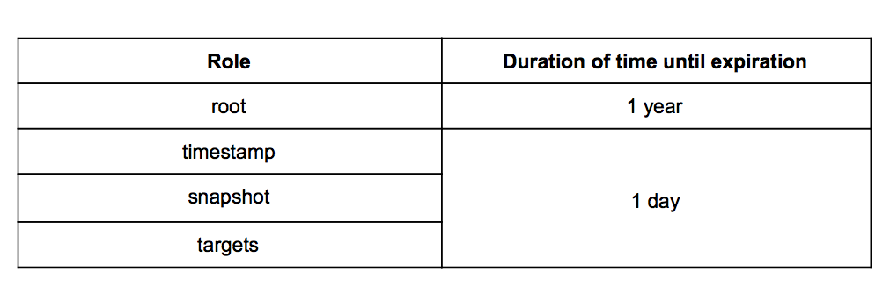

**Table 1.** _An example of the duration of time until the metadata for a role expires._

#### 4.2.2.2 Image repository

For the Image repository, each role MAY use as many keys as is desired, though the greater the impact of key compromise for a given role, then the greater the number of keys that it SHOULD use. Also, a threshold number of keys SHOULD be required, so that a single key compromise is generally insufficient to sign new metadata. To further increase compromise resilience, each key SHOULD be unique across all roles.

Since the Root role has the highest impact when its keys are compromised, it SHOULD use a sufficiently large threshold number of keys. Each key MAY belong to a different repository administrator. For example, if there are 8 administrators, then at least 5 keys SHOULD be required to sign the Root metadata file, so that a quorum is required to trust the metadata.

Since the Targets role also has a high impact when its keys are compromised, it SHOULD also use a sufficiently large threshold number of keys. For example, 3 out of 4 keys MAY be required to sign the Targets metadata file.

Since the Timestamp and Snapshot roles have a relatively low impact when its keys are compromised, each role MAY use a small threshold number of keys. For example, each role MAY use 1 out of 2 keys to sign its metadata file.

Finally, each delegated Targets role SHOULD use at least 1 out of 2 keys to sign its metadata file, so that one key is available in case the other is lost. It is RECOMMENDED that the higher the number of ECUs that can be compromised if a delegated Targets role is compromised, then the higher the threshold number of keys that SHOULD be used to sign the role metadata.

##### 4.2.2.2.1 Metadata expiration times

The Uptane Standard requires all metadata files to have expiration times in order to prevent or limit freeze attacks. If ECUs know the time, then attackers cannot indefinitely replay outdated metadata, and hence, images. In general, the expiration date for a metadata file depends on how often it is updated. The more frequently it is updated, then the faster it SHOULD expire, so that man-in-the-middle attackers are unable to execute freeze attacks for too long. Even if it is not updated frequently, it SHOULD expire after a bounded period of time, so that stolen or lost keys can be revoked and replaced.

Since the Root role keys are expected to be revoked and replaced relatively rarely, its metadata file MAY expire after a relatively long time, such as one year.

Table 2 lists an example of expiration times for metadata files on the Image repository.

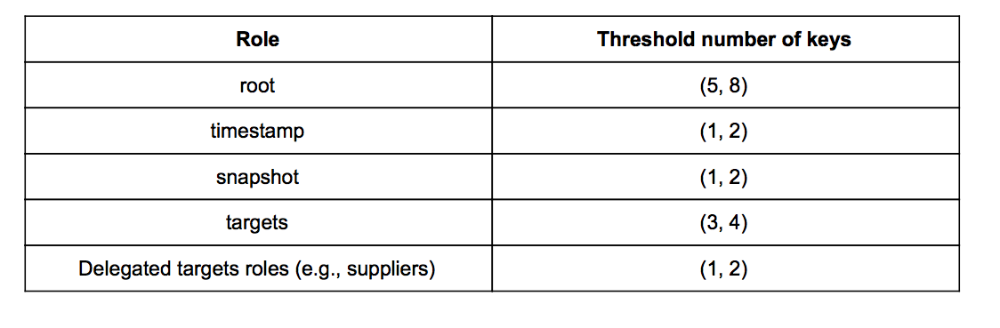

**Table 2.** _An example number of keys that MAY be used by each role. Each role uses a threshold of (n, m) keys, where n out of m signatures are required to trust the signed metadata._

## 4.3 What to do in case of key compromise

An OEM and its suppliers SHOULD be prepared to handle a key compromise. If the recommended number and type of keys are used, this should be a rare event. Nevertheless, when it happens OEMs and suppliers could use the following recovery procedures.

### 4.3.1 Director repository

Since the Director repository SHALL keep at least some software signing keys online, a compromise of this repository can lead to some security threats, such as mix-and-match attacks. Thus, the OEM SHOULD take great care to protect this repository and reduce its attack surface as much as possible. This MAY be done, in part, by using a firewall. However, if the repository has been compromised, then the following procedure SHOULD be performed in order to recover ECUs from the compromise. Following the type and placement of keys prescribed for the Director repository, we assume that attackers have compromised the online keys to the Timestamp, Snapshot, and Targets roles, but not the offline keys to the Root role.

First, the OEM SHOULD use the Root role to revoke and replace the keys to the Timestamp, Snapshot, and Targets roles, because only the Root role can replace these keys.

Second, the OEM SHOULD consider a manual update of all vehicles in order to replace these keys, particularly if the vehicle has partial verification Secondaries. This update MAY be done by requiring vehicle owners to visit the nearest dealership. Although an OEM could replace these keys on a full verification ECU by using over-the-air broadcasts, a manual update is recommended because: 1. the OEM SHOULD perform a safety inspection of the vehicles, in case of security attacks, and 2. partial verification Secondaries are not designed to handle key revocation and replacement over-the-air. In order to update keys for partial verification Secondaries, the OEM SHOULD overwrite their copies of the Root metadata file, perhaps using new images.

After inspecting the vehicle, the OEM SHOULD replace and update metadata and images on all ECUs to ensure that the images are known to be safe and that partial verification Secondaries have replaced the keys for the Director repository.

### 4.3.2 Image repository

If the recommendations for the type and placement of keys described above for the Image repository are followed, then a key compromise of this repository should be an unlikely event. However, should one occur, it is a much more serious affair. A compromise of the Image repository would allow attackers to tamper with images without being detected, and thus execute arbitrary software attacks. There are two cases for handling a key compromise, depending on whether the key is managed by a delegated supplier or by the OEM.

#### 4.3.2.1 Supplier-managed keys

In the first case, where a tier-1 supplier or one of its delegatees has had one or more of its keys compromised, the supplier and its affected delegatees (if any) SHOULD revoke and replace keys. They SHOULD update metadata, including delegations and images, and send them to the OEM.

The OEM SHOULD then manually update only affected vehicles that run software maintained by this supplier in order to replace metadata and images. This MAY be done by requiring vehicle owners to visit the nearest dealership. A manual update SHOULD be done because, without trusted hardware (such as a TPM), it is difficult to ensure that compromised ECUs can be remotely and securely updated. After inspecting the vehicle, the OEM SHOULD replace and update metadata and images on all ECUs so that these images are known to be safe.

#### 4.3.2.2 OEM-managed keys

The second case, where the OEM has had a key compromised, can be far more serious than the first case. An attacker in such a position may be able to execute attacks on all vehicles, depending on which keys have been compromised. If the keys are for the Timestamp and Snapshot roles, or the Targets or Root roles, then the OEM SHOULD use the following recovery procedure.

First, the OEM SHOULD use the Root role to revoke and replace keys for all affected roles. Second, it SHOULD restore all metadata and images on the Image repository to a known good state using an offline backup. Third, the OEM SHOULD manually update all vehicles in order to replace metadata and images. A manual update SHOULD be done because, without trusted hardware (such as a TPM), it is difficult to ensure that compromised ECUs can be remotely and securely updated.

### 4.3.3 ECU keys

If ECU keys are compromised, then the OEM SHOULD manually update vehicles to replace these keys. This is the safest course of action because, after a key compromise, an OEM cannot be sure whether it is remotely replacing keys controlled by attackers or the intended ECUs.

An OEM MAY use the Director repository and its inventory database to infer whether ECU keys have been compromised. This database is used to record vehicle version manifests that list what images an ECU has installed over time. Therefore, an OEM MAY check for any abnormal patterns of installation that could have been caused by an ECU key compromise. Note, however, that this method is not perfect, because if attackers control ECU keys, then they can also use these keys to send fraudulent ECU version reports.

## 5 Normal operating procedures

In this section, we discuss how to perform regular maintenance operations. Since these operations are carried out on a regular basis, it is important to ensure they are performed in a systematic manner so that software updates are delivered securely to ECUs.

## 5.1 Updating metadata and images

An OEM SHOULD perform the following steps whenever a new update is delivered. First, the OEM verifies the authenticity and integrity of new images delivered by its suppliers. Second, the OEM tests whether the images work as intended, before releasing them to end-user vehicles.

### 5.1.1 Receiving updates from tier-1 suppliers

In order to prevent updates from being tampered with by man-in-the-middle attackers, images SHOULD be delivered from the tier-1 supplier to the OEM in a manner that supports an extremely high degree of confidence in their timeliness and authenticity. This may entail any manner of technical, physical, and/or personnel controls.

An OEM and its suppliers MAY use any transport mechanism to deliver these files. For example, an OEM MAY maintain a private web portal where metadata and/or images from suppliers can be uploaded. This private server MAY be managed by either the OEM or the tier-1 supplier, and SHOULD require authentication to restrict which users are allowed to read and/or write certain files. Alternatively, the OEM and its suppliers MAY use email or courier mail.

If the supplier signs its own images, then it delivers all of its metadata, including delegations, and associated images. Otherwise, if the OEM signs images on behalf of the supplier, then the supplier needs to update only images, leaving the OEM responsible for producing signed metadata. Regardless of which party produces signed metadata, the release counters associated with images SHOULD be incremented, so that attackers who may compromise the Director repository can not rollback to obsolete images (see the [Enhanced Security Practices](https://uptane.github.io/deployment-considerations/security_considerations.html) section of this document for more on this attack.)

Regardless of the transport mechanism used to deliver them, the OEM needs to ensure that the images received are authentic and have not been altered. The OEM SHOULD double-check the authenticity and integrity of these images by using some out-of-band mechanism for verification. For example, to obtain a higher degree of assurance, and for additional validation, the OEM MAY also require the supplier’s update team to send a PGP/GPG signed email to the OEM’s security team listing the cryptographic hashes of the new files.

Alternatively, the OEM MAY require that updates be transmitted via a digital medium that is delivered by a bonded and insured courier. To validate the provided files, the OEM and a known contact at the supplier MAY have a video call in which the supplier provides the cryptographic hashes of the metadata and/or images, and the OEM confirms that the hashes match.

An OEM SHOULD perform this verification even if a trusted transport mechanism is used to ensure the mechanism has not been compromised. If the suppliers have signed metadata, then the OEM SHOULD verify metadata and images by checking version numbers, expiration timestamps, delegations, signatures, and hashes, so that it can be sure that the metadata matches the images.

### 5.1.2 Testing metadata and images

After the OEM has somehow verified the authenticity and integrity of new metadata and images received from the tier-1 supplier, the OEM SHOULD test both before releasing them to ensure that the images work as intended on end-user vehicles. To do so, It SHOULD use the following steps.

First, the OEM SHOULD add these metadata and images to the Image repository. It SHOULD also add information about these images to the inventory database, including any dependencies and conflicts between images for different ECUs. Both of these steps are done to make the new metadata and images available to vehicles.

Optionally, if images are encrypted on demand per ECU, then the OEM SHOULD ensure that the Director repository has access to the original, unencrypted images, so that automated processes running the Director repository are able to encrypt them in the first place. It does not matter how the original, unencrypted images are stored on the Director repository. For example, they MAY be stored unencrypted, or they MAY be encrypted using a master key that is known by the automated processes. See the [Preparing an ECU for Uptane](https://uptane.github.io/deployment-considerations/ecus.html) section of this document for more details.

Second, the OEM SHOULD test the updated metadata and images on reserved vehicles before releasing them to all vehicles in circulation. This step is done to verify whether these images work as intended. If testing is done, the OEM MAY instruct the Director repository to first install the updated images on these reserved vehicles.

Finally, the OEM SHOULD update the inventory database, so that the Director repository is able to instruct appropriate ECUs on all affected vehicles on how to install these updated images.

## 5.2 Backup and garbage collection for the Image repository

The OEM SHOULD regularly perform backup and garbage collection of the metadata and images on the Image repository. This is done to ensure the OEM is able to safely recover from a repository compromise, and that the repository continues to have sufficient storage space. To do so, an OEM MAY use either the following steps, or its own corporate backup and garbage collection policy.

First, an automated process SHOULD store every file on the Image repository, as well as its cryptographic hash on a separate, offline system. A copy of the inventory database from the Director repository SHOULD also be stored on this offline system. This allows administrators to detect and recover from a repository compromise.

Second, the automated process SHOULD remove expired metadata from the Image repository to reclaim storage space. If the OEM is interested in supporting delta updates for vehicles that have not been updated for a long time, then the automated process SHOULD NOT remove images associated with expired metadata, because these images MAY be needed in order to compute delta images. (See the Delta update strategies subsection of the [Customizing Uptane](https://uptane.github.io/deployment-considerations/customizations.html#delta-update-strategies) section of this document).

## 6 Exceptional operations

In this section, we discuss operations that are generally performed only in exceptional cases. As performing these operations may have security implications for software updates, they should be carried out with great care.

## 6.1 Rolling back software

Sometimes an OEM may determine that the latest updates are less reliable than previous ones. In that case, it may be necessary to roll back to a previous update.

By default, Uptane does not allow updates to be rolled back and enforces this action with two mechanisms. First, Uptane rejects any new metadata file with a version number lower than the one contained in the previous metadata file. Second, Uptane will reject any new image associated with a release counter that is lower than the release counter of the previous image in the previous Targets metadata file. The first mechanism prevents an attacker from replaying an old metadata file. The second mechanism prevents an attacker who compromises the Director repository from being able to choose old versions of images, despite being able to sign new metadata. See Figure 1 for an example.

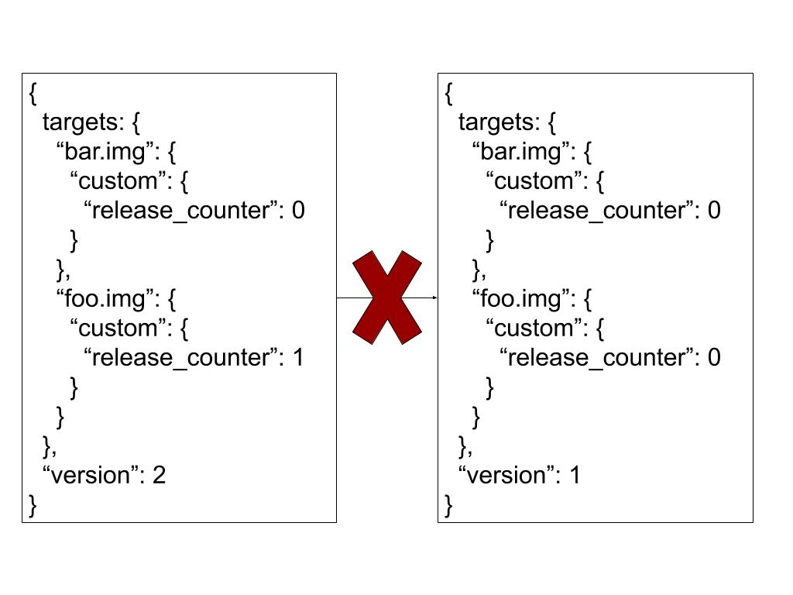

**Figure 1.** _Uptane prevents rollback attacks by rejecting older: (1) metadata files, and/or (2) images._

There are at least two ways to allow rollbacks, each with different advantages and disadvantages.

In the first option, an OEM MAY choose to never increment the release counters of images (see Figure 2). Uptane will accept any new image associated with a release counter, as long as it is equal to the release counter of the previous image in the previous Targets metadata file. If release counters are never incremented, then all images would have the same release counters. In this situation, an ECU would accept the installation of any compatible image referred to in the new Targets metadata. (See the [Enhanced Security Practices](https://uptane.github.io/deployment-considerations/security_considerations.html) section of this document for more details.)

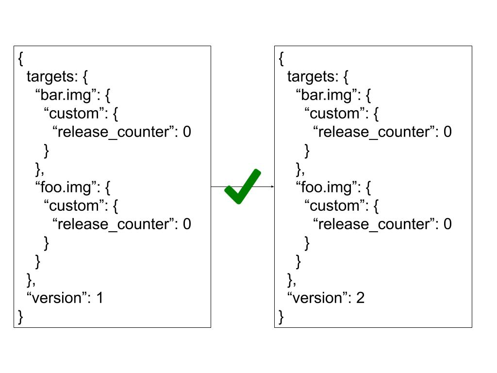

**Figure 2.** _Uptane allows the installation of images that have the same release counter as what is currently installed._

The advantage to this method is that it is simple. It allows the OEM to easily install interchangeable versions of the same image. In the example shown in Figure 2, “foo.img” may simply be a version of “bar.img” containing diagnostic functions. Therefore, the OEM may install either “bar.img” or “foo.img” on the same ECU. The disadvantage of this method is that it allows attackers who compromise the Director repository to install obsolete images they can use to execute rollback attacks. Therefore, this method SHOULD NOT be used.

In the second option, an OEM increments the release counter of an image whenever it is critical that an ECU not install images with lower release counters. In the example in Figure 3, if an ECU installs “foo.img,” then it cannot install “bar.img.” This is done to prevent the installation of compatible images with lower release counters that have known security vulnerabilities, rather than newer images in which these vulnerabilities have been fixed.

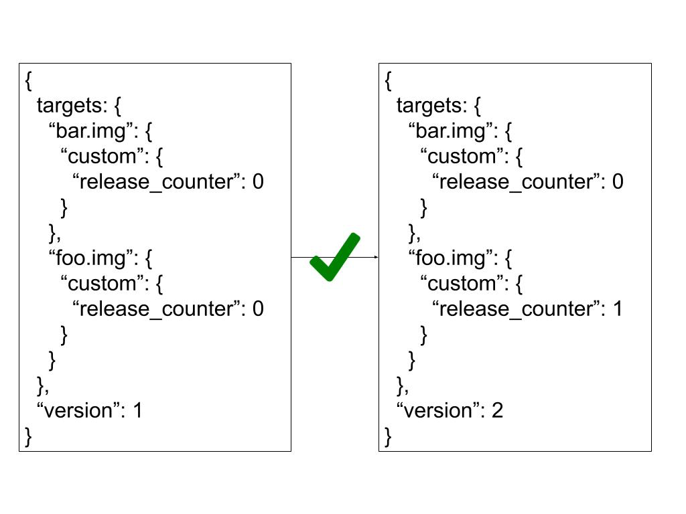

**Figure 3.** _Uptane forbids the installation of images with lower release counters than what is currently installed._

The advantage to this method is that it prevents rollback attacks in a situation where attackers compromise only the Director repository. However, there are two disadvantages. First, the release counters for images have to be maintained, even if role B now signs for images previously signed by role A. This is because release counters are always compared to previous Targets metadata files. Second, it is more cumbersome to roll back updates, or deliberately cause ECUs to install older images, because offline keys are used to increment the release counters of these older images in the new Targets metadata for the Image repository. Yet, this method SHOULD be preferred, because it is more secure. See the [Enhanced Security Practices](https://uptane.github.io/deployment-considerations/security_considerations.html) section of this document for more techniques that can be used to limit rollback attacks when the Director repository is compromised.

## 6.2 Adding, removing, or replacing ECUs

Sometimes it may be necessary for a dealership or mechanic to replace a particular ECU in a vehicle, or even add or remove one. This will mean that the vehicle version manifest will change – even if the replacement ECU is an identical model, it will have a different ECU key. The Director may detect this as an attack, as an ECU suddenly using a new signing key could indicate a compromise.

We recommend dealing with this use case by establishing an out-of-band process that allows authorized mechanics to report a change to the OEM. By doing so, the change in ECU configuration will be recorded in the inventory database. Exactly what that process will look like depends on the size of the manufacturer, and the relative frequency of ECU replacements.

- A small luxury automaker might simply choose to allow authorized mechanics to send an email or make a phone call to an aftersales support person with the details of the new ECU, and have that person manually enter the details.
- A larger automaker might choose to deploy a dealer portal (i.e., a private, authenticated website) to allow authorized service centers to enter the details of the new ECU configuration themselves.

Another option for updating the ECU configuration is to have a process that temporarily “unlocks” an ECU configuration, allowing the vehicle’s Primary to directly report its new configuration (as opposed to having the mechanic enter the details of the replaced ECU). There is a tradeoff here. While it streamlines the repair process, automating this step increases the risk that a real attack could go unnoticed.

Note, however, that these are only recommendations. Uptane does not prescribe a protocol for this use case because it is an orthogonal problem to software _update_ security. The advantage of this approach is that an OEM is free to solve this problem using existing solutions that it may already have in place.

### 6.2.1 Aftermarket ECUs

A slightly more difficult use case to deal with concerns the use of aftermarket ECUs – for example, 3rd-party replacement parts, or add-on ECUs that add functionality for commercial fleet management. Though from a technical perspective adding an aftermarket ECU can be managed in one of the ways recommended in the previous subsection, there is no doubt that these components bring with them a set of unique logistical and security concerns. For starters, because aftermarket suppliers may not have access to the original design, these ECUs are often products of reverse engineering. As such, suppliers may not be able to glean all relevant design information about the ECU, including the rationale behind certain choices. Furthermore, the use of these components raises a number of fundamental questions, such as: - If an aftermarket ECU does not have its own primary, will it still be able to get updates through an existing OEM primary ECU, as long as the OEMs Director repository permits it? - If an aftermarket ECU does have its own Primary, is each capable of controlling a mutually exclusive set of Secondaries? - Could owners (or third parties) direct updates for their own vehicles from both an OEM and an aftermarket source?

While at this point the easiest alternative might be to simply exclude aftermarket ECUs from receiving OTA updates, this might not be feasible. For starters, older vehicles depend heavily on aftermarket parts. Garages (including OEM dealers) regularly install aftermarket ECUs when an OEM stops producing them. Furthermore, the newly strengthened [Massachusetts Right-to-Repair law](https://en.wikipedia.org/wiki/2020_Massachusetts_Question_1) complicates both the distribution of ECU firmware updates and the attendant functional safety and cybersecurity issues. Among other provisions, the law mandates a platform to permit vehicle owners and independent mechanics to access telematics. Hence, OEMs may not have a say anymore on whether or not these units receive OTA updates.

Note that some aftermarket ECUs, such as those designed for fleet management or monitoring, may have their own independent internet connection, and thus do not need to be integrated into the OEM’s update system at all.

While at this point Uptane is not ready to include any specific guidance on aftermarket material use in its Standard, it is an issue the community is closely monitoring, particularly in the context of pending international standards such as [ISO/SAE 21434](https://www.iso.org/standard/70918.html).

## 6.3 Adding or removing a supplier

Due to changes in business relationships, an OEM may need to add or remove a tier-1 supplier from its repositories.

To add a tier-1 supplier, OEMs SHOULD use the following steps. All three steps should be performed using the guidelines in the [Normal Operating Procedures](https://uptane.github.io/deployment-considerations/normal_operation.html) section of this document. First, if the supplier signs its own images, then the OEM SHOULD add a delegation to the supplier on the Image repository. Second, the supplier SHOULD deliver metadata and/or images to the OEM. Finally, the OEM SHOULD add the metadata and images to its repositories, possibly test them, and then release them to the affected vehicles.

To safely remove a tier-1 supplier, the OEM SHOULD use the following steps. First, it SHOULD delete the corresponding delegation from the Targets role on the Image repository, as well as all metadata and images belonging to that supplier, so that their metadata and images are no longer trusted. Second, it SHOULD also delete information about the supplier from the Director repository, such as its images, as well as its dependencies and conflicts, so that the Director repository no longer chooses these images for installation. In order to continue to update vehicles with ECUs originally maintained by this supplier, the OEM SHOULD replace this supplier with another delegation, either one maintained by the OEM, or by another tier-1 supplier.

Note that to comply with the [Standard](https://uptane.github.io/papers/uptane-standard.1.1.0.html#check_snapshot), the Snapshot metadata must continue to list the removed delegation in order to prevent a rollback attack. However, if the OEM rotates the Timestamp and Snapshot keys (and pushes new Root metadata with the new keys), the delegation may be safely removed from the Snapshot metadata. As the ECU will need to clear out any existing Snapshot metadata due to the rotation, the check that each Targets metadata filename listed in the previous Snapshot metadata is also listed in the new Snapshot metadata will (trivially) not apply.

Tier-1 suppliers are free to manage delegations to members within its own organizations, or to tier-2 suppliers (who may delegate, in turn, to tier-3 suppliers, and so on), without involving the OEM.

## 6.4 Key compromise

See [Key Management](https://uptane.github.io/deployment-considerations/key_management.html).

## 7 Customizing Uptane

In this section, we discuss how OEMs and suppliers may customize Uptane to meet special requirements.

## 7.1 Scope of an update

An OEM and its suppliers MAY use an image to arbitrarily update some code and data on an ECU, but not all. In addition, an image can be used to update code only, data only, or any other combination of the two elements.

Examples of code updates delivered via an image include the bootloader, shared libraries, or the application that provides the actual functions of the ECU. Examples of data updates include setup or initialization data, such as engine parameters, application data, such as maps, and user data, such as an address book or system logs.

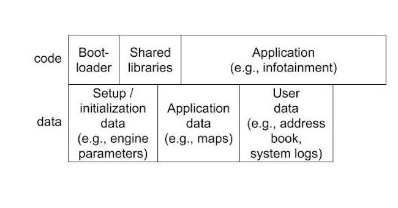

**Figure 1.** _An example of how code and/or data may constitute an image._

## 7.2 Delta update strategies

In order to save bandwidth costs, Uptane allows an OEM to deliver updates as delta images. A delta image update contains only the code and/or data that differs from the image currently installed on the ECU. In order to use delta images, the OEM SHOULD make the following changes.

The OEM SHOULD add two types of information used by the Director repository to the custom Targets metadata: (1) the algorithm used to apply a delta image, and (2) the Targets metadata about the delta image. This is done so that ECUs know how to apply and verify the delta image. The Director repository SHOULD also be modified to produce delta images, because Uptane does not require it to compute deltas by default. The Director repository can use the vehicle version manifest and dependency resolution to determine the differences between the previous and latest images. If desired, the Director repository MAY encrypt the delta image.

As these images are produced on demand by the Director repository, Primaries SHOULD download all delta and/or encrypted images only from that source. After full verification of metadata, Primaries SHOULD also check whether delta images match the Targets metadata from the Director repository in the same manner in which they would check such metadata when using non-delta images.

Finally, in order to install a delta image, an ECU SHOULD take one of the actions described in Table 1, depending on whether or not the delta image has been encrypted, and if the ECU has sufficient additional storage to store a copy of the image. Note that the OEM MAY use stream ciphers in order to enable on-the-fly decryption on ECUs that do not have sufficient additional storage. In this case, the ECU would decrypt the delta image as it is downloaded, then follow the remainder of the steps in the third box.

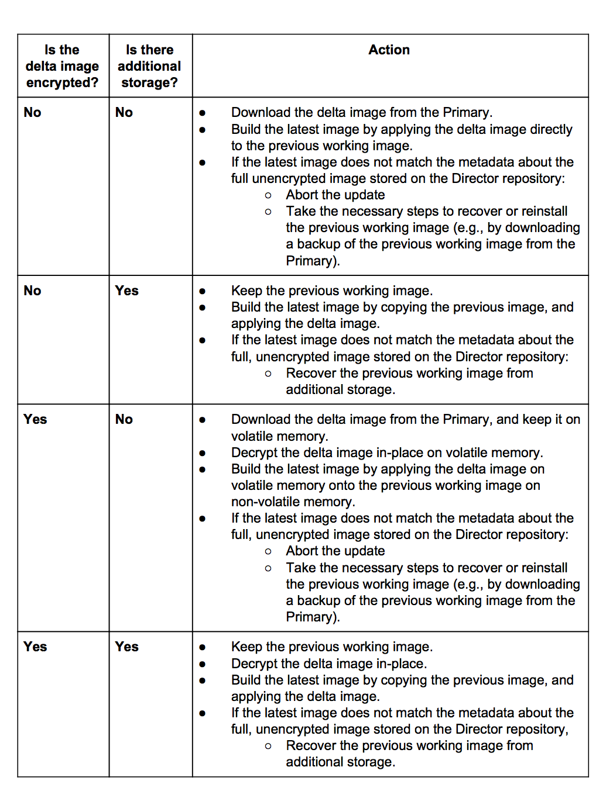

**Table 1.** _The actions an ECU SHOULD take to install a delta image as determined by its access to additional storage and whether or not the image is encrypted_

### 7.2.1 Dynamic delta updates vs. precomputed delta updates

Delta updates can be computed two different ways: dynamically for each ECU during the installation process (dynamic delta updates), or in advance of installation by precomputing likely possible delta images (precomputed delta updates). Both types of updates appear below in the subsection on [custom installation instructions](#custom-installation-instructions-for-ecus).

Dynamic delta updates reduce the amount of data sent in each update, while allowing for fine-grained control of what version is installed on each ECU. By using the custom field of the Targets metadata, the Director can be configured to specify a particular version of software for every ECU. Dynamic delta updates allow the Director to track resources at file granularity, which can save bandwidth.

A drawback of dynamic delta updates is that, if many ECUs are updating from the same version, computing the delta of each can result in duplicate computation that could be time consuming or use up a lot of memory. A possible solution to this is to use precomputed delta updates.

To send precomputed delta updates, the Director precomputes various probable diffs and makes these available as images. The Director then specifies which precomputed image to send to each ECU by using the custom field of Targets metadata, as described below in the [Adding dynamic directions](#accessing-dynamic-directions-through-signed-images-from-the-director-repository) subsection. Precomputing the delta images has the added advantage of allowing these images to be stored on the Image repository, which offers additional security against a Director compromise.

## 7.3 Uptane in conjunction with other protocols

Implementers MAY use Uptane in conjunction with existing protocols for sending updates to the vehicle, such as in the following scenarios:

Implementers MAY use [TLS](https://en.wikipedia.org/wiki/Transport_Layer_Security) to encrypt the connection between Primaries and the Image and Director repositories, as well as the connection to the source used to provide the current time.

Implementers MAY use [OMA Device Management](https://en.wikipedia.org/wiki/OMA_Device_Management) (OMA-DM) to send Uptane metadata, images, and other messages to Primaries.

Implementers MAY use [Unified Diagnostic Services](https://en.wikipedia.org/wiki/Unified_Diagnostic_Services) (UDS) to transport Uptane metadata, images, and other messages between Primaries and Secondaries.

Any system being used to transport images to ECUs will need to be modified only to permit transport of Uptane metadata and other messages. Note that Uptane does not require authentication of network traffic between the Director and Image repositories and Primaries, or between Primaries and Secondaries.

However, in order for an implementation to be Uptane-compliant, no ECU can cause another to install an image without performing either full or partial verification of metadata. This is done in order to prevent attackers from being able to bypass Uptane and execute arbitrary software attacks. Thus, in an Uptane-compliant implementation, an ECU performs either full or partial verification of metadata and images before installing any image, regardless of how the metadata and images were transmitted to the ECU.

## 7.4 Using Uptane with transport security

In general, Uptane’s security is orthogonal to security systems at other network layers, such as transport security or data link security. If a security system at the transport layer is already deployed for other services, or is effectively free to deploy, there is little reason not to use it. For example, it could be beneficial to have a common system provide authentication for all services in a vehicle. For new implementations, there are several reasons to consider use of a security system at the transport layer in coordination with Uptane.

The most important of these reasons is to insure, as should be true of all cybersecurity sensitive applications, that Uptane implementations use defense-in-depth strategies, as defined in [NIST Document IR.8183](https://nvlpubs.nist.gov/nistpubs/ir/2017/NIST.IR.8183.pdf), to ensure that all vulnerabilities and attack surfaces are protected by multiple and diverse detection and mitigation defenses. Thus, even though Uptane is designed to retain strong security guarantees in situations where there is either no transport security or where the transport security is compromised by an attacker, building on top of a such a system can augment the application layer image signature/package signature. There is little downside to such an arrangement as long as the cost is minimal, especially if the security system can improve detection, mitigation, or reporting of network disruptions. Another argument for using a transport security system is that emerging regulations or OTA update standards could require or recommend that security be provided at the transport layer.

## 7.5 Multiple Primaries

We expect that the most common deployment configuration of Uptane on vehicles would feature one Primary per vehicle. However, there could be cases where having multiple, active Primaries in a vehicle would be useful. One such case would be providing redundancy if some, but not all, Primaries fail permanently. The OEM MAY use this setup to design a failover system in which one Primary takes over when another fails. If so, then the OEM SHOULD take note of the following considerations in order to prevent safety issues.

It is highly RECOMMENDED that, in any given vehicle, there be a single, active Primary. This is because using multiple, active Primaries to update Secondaries can lead to problems in consistency, especially when different Primaries try to update the same Secondaries. If an implementation is not careful, race conditions could cause Secondaries to install an inconsistent set of updates, with some ECUs installing updates from one Primary, while others take their updates from the second Primary. This can cause ECUs to fail to interoperate.

If multiple Primaries are active in the vehicle at the same time, then each Primary SHOULD control a mutually exclusive set of Secondaries, so that each Secondary is controlled only by one Primary.

## 7.6 Atomic installation of a bundle of images

An OEM might wish to require atomic installation of a bundle of images, which means that if one or more update in the bundle fails, none of them will be installed. Uptane does not provide a way to guarantee atomic installations because the problem of atomicity is out of its scope. It is challenging for ECUs to atomically install a bundle in the face of arbitrary failure. If just one ECU fails to install its update for any reason, such as a hardware failure, then the guarantee of atomicity is lost. Furthermore, different OEMs and suppliers already have established ways of solving this problem. Nevertheless, we discuss several different solutions for those who require guidance on this technique.

The simplest solution is to use the vehicle version manifest to report any atomic installation failures to the Director repository, and then not retry installation. After receiving the report, it is up to the OEM to decide how to respond. For example, the OEM MAY require the owner of the vehicle to diagnose the failure at the nearest dealership or authorized mechanic.

Another simple solution is for the Primary and/or Director to retry a bundle installation until it either succeeds or reaches a set maximum number of retries. This solution has the advantage of not requiring ECUs to perform a rollback if a bundle is not fully installed, a step ECUs with limited secondary storage cannot perform.

If all ECUs do have sufficient additional storage, and can perform a rollback, then the OEM could use a [two-phase commit protocol](https://en.wikipedia.org/wiki/Two-phase_commit_protocol). We assume that a gateway ECU would act as the coordinator, which ensures that updates are installed atomically. This technique should ensure atomic installation as long as: (1) the gateway ECU behaves correctly and has not been compromised, and (2) the gateway ECU does not fail permanently. It is considerably less complicated than Byzantine-fault tolerant protocols, which could have a higher computation/communication overhead. However, this technique does not provide other security guarantees. For example, the gateway ECU could show different bundles to different Secondaries at the same time.

## 7.7 2nd-party fleet management

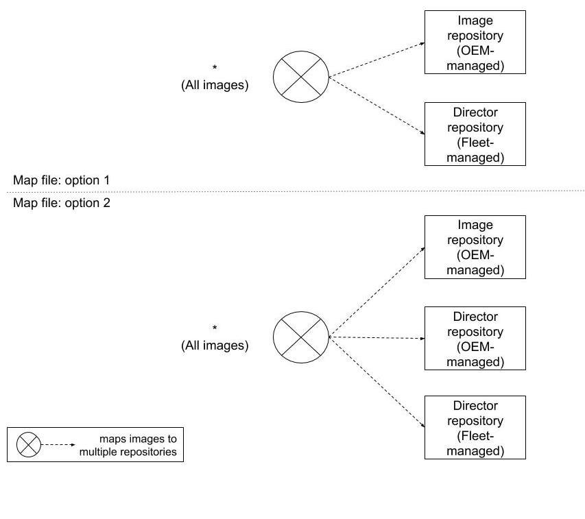

**Figure 2.** _Two options for fleet management with Uptane._

Some parties, such as vehicle rental companies or the military, might wish to exercise control on how their own fleet of vehicles are updated. Uptane offers two options for serving these users, as illustrated in Figure 2. Choosing between them depends on whether the fleet manager wishes to have either complete control, or better compromise-resilience.

In the first option, which we expect to be the common case, a fleet manager would configure the mapping metadata on ECUs such that Primaries and full verification Secondaries would only trust an image that has been signed by _both_ the OEM-managed Image repository and the fleet-managed Director repository. Partial verification Secondaries would only trust an image if it has been signed by the fleet-managed Director repository. The upside of this option is that the fleet manager, instead of the OEM, has complete control over which updates are installed on its vehicles. The downside of this option is that if the fleet-managed Directory repository is compromised, attackers can execute mix-and-match attacks.

In the second option, a fleet manager would configure the mapping metadata on ECUs such that Primaries and full verification Secondaries would trust an image that has been signed by _three_ repositories: the OEM-managed Image repository, the OEM-managed Director repository, and the fleet-managed Director repository. The upside of this option is that attackers cannot execute mix-and-match attacks if they have compromised only one of the Director repositories. The downside of this option is that updates cannot be installed on vehicles unless both the OEM and fleet agree on which images should be installed. This agreement could require both Director repositories to communicate using an out-of-band channel. Using this option also means that partial verification Secondaries should be configured to trust the Director repository managed by either the OEM or the fleet, but not both, since these Secondaries might only be able to check for one signature.

## 7.8 User-customized updates

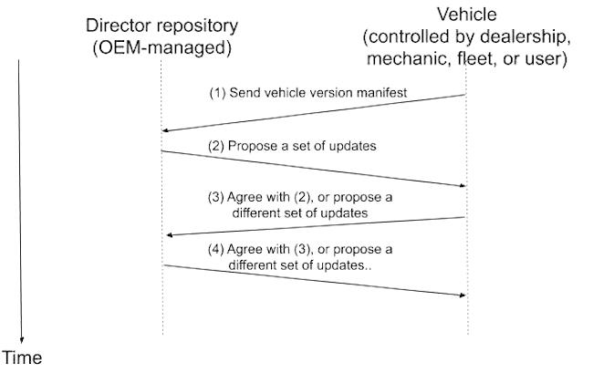

**Figure 3.** _An OEM MAY allow a third party to negotiate which updates are installed._

In its default implementation, Uptane allows only the OEM to fully control which updates are installed on which ECUs on which vehicles. Thus, there is no third party input about updates from a dealership, mechanic, fleet manager, or the end-user. There are very good reasons, such as legal considerations, for enforcing this constraint. However, sharing this capability exists to the extent that the OEM wishes to make it available. We discuss two options for doing so.

In the first option, an OEM MAY elect to receive input from a third party as to which updates should be installed. The process is illustrated in Figure 3.

**Step 1:** The vehicle submits its vehicle version manifest to the Director repository controlled by the OEM. The manifest lists which updates are currently installed.

**Step 2:** The Director repository performs dependency resolution using the manifest, and proposes a set of updates.

**Step 3:** The third party either agrees with the OEM, or proposes a different set of updates. This step SHOULD be authenticated (e.g., using client certificates, or username and password encrypted over TLS), so that only authorized third parties are allowed to negotiate with the OEM.

**Step 4:** The OEM either agrees with the third party, or proposes a different set of updates.

The third and fourth steps MAY be repeated up to a maximum number of retries, until both the OEM and the third party agree as to which updates should be installed.

In the second option, the third party MAY choose to override the root of trust for ECUs, provided that the OEM makes this possible. Specifically, the third party could overwrite the map and Root metadata file on ECUs, so that updates are trusted and installed from repositories managed by the third party instead of the OEM. The OEM could infer whether a vehicle has done so by using its inventory database to see if the vehicle has recently been updated from its repositories. The OEM MAY choose to not make this option available to third parties. It can do so, for example, by using a Hardware Security Module (HSM) to store Uptane code and data, which prevents third parties from overriding the root of trust.

## 7.9 Custom installation instructions for ECUs

Most inputs to ECUs are delivered as signed Targets files, stored on the Image directory, and then sent to the ECU by the Director. However, there could be some cases where the inputs required for a particular customization cannot be configured to follow this standard signing process. Variations in input could be due to not knowing the input in advance, or a need to customize instructions for each vehicle. Examples of such inputs could be a command line option that turns on a feature in certain ECUs, a configuration sent by a Director repository to an ECU, or a Director doing a dynamic customization for an ECU. We can collectively call all these non-standard inputs “dynamic directions.” Uptane allows ECUs to access dynamic directions in two different ways, each having particular advantages for different use cases.

### 7.9.1 Accessing dynamic directions through signed images from the Director repository

The first option for providing dynamic directions is to slightly modify the standard delivery procedure described above. The Director repository would still send a signed image to the ECU, but this file would not be stored on – or validated by – the Image repository. As the Image repository is controlled by offline keys, it cannot validate a file created dynamically by the Director.

Even though the Image repository cannot sign the file, this modification still provides some security protections. The ECU would continue to have rollback protection for a file sent this way, as a release counter will still be included in the metadata and incremented for each new version. If additional validation is needed, the file could be put on multiple repositories created for this purpose. These repositories could behave similar to the Director repository, but would all have separate keys to allow for additional security. The Primary ECU will be aware of these extra repositories so it can check for consistency by downloading and comparing the image from all repositories.

### 7.9.2 Adding dynamic directions to the custom field of Targets metadata

Another way to provide dynamic directions is to use the custom field of the Targets metadata file. This field provides the option to include custom inputs to individual ECUs. Using the custom field is an especially good option for managing small variations in the existing image. For example, a compilation flag to enable a navigation feature might be set on some ECUs, but not on others. The custom field could contain dynamic directions, and additional subfields would help determine for which ECUs the direction is intended. In this flag example, the Director can put the ECU ID and the flag into the custom field so the flag will be used during the installation process only on that particular ECU. This custom field can then be included in the Targets metadata received by all ECUs. The intended ECU would be able to check for this flag and use it during an installation or update to enable the navigation system.

However, using this method of providing dynamic directions means that a compromise of the Director repository might be able to cause ECUs to misconfigure their images. One way to mitigate this risk would be to require the Image repository to sign off on exactly the same directions using its own custom Targets metadata. It should be noted, though, that this is difficult to achieve considering that such directions are supposed to be dynamic in the first place. Therefore, proceed, if necessary, with caution.

### 7.9.3 Picking an option: security tradeoff

In choosing whether to send dynamic directions through the custom field of the Targets metadata from either the Director or the Image repository, one needs to consider how security-sensitive the receiving ECU may be.

Using the Director repository to encode dynamic directions provides more flexibility, as directions can be made or changed on demand. However, there is a significant trade off in terms of security. Should the Directory repository be compromised, attackers would have this same power. This has important ramifications for ECUs that perform partial, or even full, verification. On the other hand, using the Image repository provides the opposite tradeoff. Dynamic directions are more secure, but offer less flexibility to make changes.

It is important to consider this tradeoff when deciding how to send dynamic directions. If the ECU is security critical, these directions should be sent using the custom field of Targets metadata and stored on the Image repository. In any case, using either repository should not result in significant bandwidth costs for ECUs, as ECUs that perform partial verification should continue to receive only directions for itself from the Director repository.

## 7.10 Location-based updates

Certain types of updates, like maps, rules-of-the-road, or traffic notifications, are only relevant to vehicles within a specific location. These location-based updates require that a device be able to report its location in some way. For example, the device could obtain its location by using a GPS sensor and report it as custom metadata in the vehicle version manifest using the “geo:” UI scheme defined in [RFC 5870](https://tools.ietf.org/html/rfc5870).

Such a system would require a way to reference location for all applicable targets in the custom section of the Targets metadata for the Image repository. The Director would then be responsible for identifying which device locations match those of targets on the Image repository. If a match is found, the Director SHOULD update its Targets metadata to instruct the relevant devices to install the location-based updates appropriate for their positions.

It is possible that the vehicle’s position may have changed by the time the vehicle receives a location-based update. The device MAY check that its current position matches that of the target before installation, and the implementer MAY decide to abort the update if the location no longer matches.

### 7.10.1 Government updates

In certain instances, government agencies and regulatory bodies, such as the U.S. Department of Transportation, the Department of Homeland Security, or the Federal Emergency Management Agency (or their state, local, or international equivalents), may need to download location specific updates directly to vehicles. A scenario of this type might occur if there are changes to the rules of the road across a state or country border, or if re-routing needs to occur due to an emergency condition, such as a flood.

Being able to grant this sort of access would likely require changes in some Uptane configurations, such as adding Director or Image repositories, or supporting different key management systems. Prioritizing conflicting updates in such a system would bring with it a number of questions. For example, if a government agency has the ability to remotely override functionality of a vehicle, would these commands be issued by one central server, or would each OEM have to maintain two Director repositories—one for the company and one for the agency? If a government body can issue a command for an update, would a driver be able to pull to the side of the road, or reduce speed to below 25 MPH at a safe deceleration rate, or would the vehicle come to a stop wherever it might be?

At this point, Uptane is not ready to propose an answer to any of these questions. As other standards teams (ISO 204 and IEEE 1609) are currently considering the issue of government updates, we prefer to wait on those decisions, and then work with automotive community to adapt the existing Standard to meet these design requirements.

## 8 Enhanced security practices

Uptane is a flexible system and therefore can be adapted for increased security if an OEM or supplier deems it necessary. In this section, we discuss several of these techniques.

### 8.0.1 Restricting image installation with custom hardware IDs

Before an ECU installs a new image, it SHOULD always check the hardware type of the image. This can prevent attackers from causing an ECU to install arbitrary images it was not intended to have. Furthermore, an OEM and/or its suppliers SHOULD include certain information about images in the Targets metadata to prevent the installation of these arbitrary images if the Director repository should be compromised.

Consider the following example in which attackers have compromised the Director repository. If certain mitigating steps have been taken, such as using release counters, they cannot rollback software updates. Furthermore, without an additional key compromise, attackers cannot cause arbitrary software attacks on Primaries and full verification Secondaries. However, attackers can cause the ECUs of one hardware type to install images intended for another hardware type. To use an analogy, this is similar to causing [Linksys](https://www.linksys.com/us/) routers to install images intended for [NetGear](https://www.netgear.com/) routers.

Simply having ECU identifiers (e.g., serial numbers) specified in the Targets metadata signed by the Director repository does not solve this problem because: (1) they are used by the Director repository only to instruct which ECU should install which image, and (2) they are not specified in the Targets metadata signed on the Image repository because it is impractical to list all ECU identifiers that pertain to an image.

In order to avoid this problem, the custom Targets metadata about unencrypted images on the Image repository SHOULD always include hardware identifiers. A hardware identifier allows an OEM and/or its suppliers to succinctly capture an entire class of ECUs without listing each of their identifiers. Note that the OEM and/or its suppliers SHOULD ensure that hardware identifiers are unique across different hardware types of ECUs, so that attackers who compromise the Director repository cannot cause ECUs of one type to install images intended for another type.

### 8.0.2 Integrating supply chain security into Uptane

As new legislation emerges in the wake of several high profile supply chain attacks, automakers need to consider implementing more effective end-to-end security measures for software. Both the UNECE WP.29 regulations that went into effect in some parts of the world in June 2020, and the ISO/SAE 21434 Standard published in the summer of 2021 require OEMs to ensure that the entire automotive supply chain is secure. In the United States, [Executive Order 14028](https://www.whitehouse.gov/briefing-room/presidential-actions/2021/05/12/executive-order-on-improving-the-nations-cybersecurity/) observes that “The development of commercial software often lacks transparency, sufficient focus on the ability of the software to resist attack, and adequate controls to prevent tampering by malicious actors,” and calls for a concerted effort to correct this situation.

Developing a secure software supply chain for the auto industry is complicated by a number of factors. For starters, an automobile has, on average, some [30,000 individual components](https://knowhow.napaonline.com/how-many-parts-are-in-a-car/),which can be sourced from perhaps hundreds of individual suppliers. The electronic computing units in cars are particularly diverse in suppliers, with one auto executive admitting in 2020 that only [10% of the software](https://spectrum.ieee.org/software-eating-car) in its vehicles was developed in-house. With so many outside developers committing to the code base of a car, it is difficult to impose a consistent supply chain protection strategy from company to company, or even from model to model. Similarly, the proprietary orientation of the auto industry presents another challenge. How can one protect a software supply chain without knowing the exact nature of the units you are protecting?

There are a number of supply chain security technologies that might be adapted for these purposes, either individually or in combination. One such strategy candidate is the [in-toto](https://in-toto.io/) framework, which breaks down the software supply chain into a series of steps, each of which has a “functionary,” human or otherwise, authorized to perform it. A policy is defined for each supply chain and the policy is then cryptographically signed by the supply chain owner. As each functionary performs its task, it captures separate signed metadata for each step that documents the artifacts involved. The metadata is then validated against the policy, enabling end-to-end verification of the supply chain.

The in-toto framework has already been successfully adopted or integrated into several major open source software projects, including those hosted by the Cloud Native Computing Foundation, a part of the Linux Foundation. It has already been used in tandem with The Update Framework (TUF) to provide both end-to-end security and compromise resilience for [Datadog](https://www.datadoghq.com/blog/engineering/secure-publication-of-datadog-agent-integrations-with-tuf-and-in-toto/). Using this integration as a test case, the Uptane community is looking into what might be involved in a combined Uptane and in-toto as defense against supply chain attacks on automobiles. The concept will be presented in a whitepaper in early 2022.

### 8.0.3 Secure alternatives to conventional software and identifiers

Having an unambiguous way to reference all of its components is a crucial attribute within any system. Therefore, taking a closer look at a system’s identifiers—both hardware and software—can be a worthwhile investment in enhancing system security. A system that lacks a standardized and widely accepted system of identifying components presents a potential vulnerability that can impact both the efficiency and reliability of operations. Thus, designers, suppliers, and OEMs have come to realize that the identifiers used for both the hardware or software element on a vehicle are not trivial details. Despite the emergence of alternative ECU and software ID strategies, the utilization of VIN numbers, often as the only hardware identifier on a vehicle, is still all too common a practice.

Uptane recognizes the need to adopt stronger identifiers, and future versions of this document will present strategies for upgrading the security and reliability of both ECU and software IDs. In both cases, we will consult and comply with the latest regulations and international standards. For ECU IDs, any design proposals will likely follow the example presented in the [IEEE Standard 802.1AR Device Identity](https://1.ieee802.org/security/802-1ar/), which specifies “Secure Device Identifiers (DevIDs) designed to be used as interoperable secure device authentication credentials with Extensible Authentication Protocol (EAP) and other industry standard authentication and provisioning protocols.” The document makes the case that utilizing a standardized device identity makes the authentication of interoperable secure devices easier, and simplifies secure device deployment and management.

For software ID tags any proposed actions will likely be guided by the Internet Engineering Task Force’s in-process Standard on [Concise Software Identification Tags](https://datatracker.ietf.org/doc/draft-ietf-sacm-coswid/). This Standard describes a new type of Software Identification (SWID) tag that “supports a similar set of semantics and features as SWID tags, as well as new semantics” that “allow the tags to describe additional types of information, all in a more memory efficient format.” The “Co” in CoSWID stands for concise, as it significantly reduces the amount of data transported as compared to a typical SWID tag. To make this happen, CoSWIDs use the technique of Concise Binary Object Representation (CBOR), first defined in [RFC8949](https://datatracker.ietf.org/doc/html/rfc8949). According to [Wikipedia](https://en.wikipedia.org/wiki/CBOR), CBOR “is a binary data serialization format loosely based on JSON” that “allows the transmission of data objects that contain name–value pairs, but in a more concise manner.” Though this increases processing and transfer speeds at the cost of human readability, the process is designed to automate a task that previously would require human intervention. Therefore, any trade-off in the readability of content would be negligible compared to the enhanced security value.

At this point, Uptane is not planning any imminent change in its Standard to mandate what qualifies as secure hardware or software identifiers, but we do strongly suggest adopters consider alternatives beyond just VIN numbers. Given the growing desirability of automotive systems as targets of hacking, identity is too important for security to trust to just a part number.

### 8.0.4 Preventing rollback attacks in case of Director compromise

In the [Exceptional Operations](https://uptane.github.io/deployment-considerations/exceptional_operations.html#rolling-back-software) section of this document, we discuss how an OEM and/or its suppliers SHOULD use release counters in order to prevent rollback attacks in case of a Director repository compromise. To further limit the impact of such an attack scenario, the OEM and/or its suppliers SHOULD also use the following recommendations.

First, they SHOULD diligently remove obsolete images from new versions of Targets metadata files uploaded to the Image repository. This can prevent attackers who compromise the Director repository from being able to choose these obsolete images for installation. This method has a downside in that it complicates the update process for vehicles that require an intermediate update step. For example, an ECU has previously installed image A, and C is the latest image it should install. However, the ECU should install image B before it installs C, and B has already been removed from the Targets metadata on the Image repository in order to prevent or limit rollback attacks. Thus, the OEM and/or its suppliers needs to carefully balance these requirements in making the decision to remove obsolete images from the Targets metadata.

Second, they SHOULD decrease the expiration timestamps on all Targets metadata uploaded to the Image repository so they expire more quickly. This can prevent attackers who compromise the Director repository from being able to choose these obsolete images. Unfortunately, Targets metadata that expires quickly needs to be updated more frequently. This may make it harder to prevent accidental freeze attacks, as an ECU needs to be able to update both the time and the metadata from the Image repository. In the event that the ECU is able to update metadata, but not the time, it can continue working with the previously installed image, but would be unable to update to the latest image. The Director repository can detect this unlikely event using the vehicle version manifest. In this case, the OEM MAY require the owner of the vehicle to diagnose the problem at the nearest dealership or authorized mechanic.

### 8.0.5 Broadcasting vs. unicasting metadata inside the vehicle

An implementation of Uptane MAY have a Primary unicast metadata to Secondaries. In this scenario, the Primary would send metadata separately to each Secondary. However, this method is vulnerable to network disruptions and can cause ECUs to see different versions of metadata released by repositories at different times.

In order to mitigate this problem, it is RECOMMENDED that a Primary use a broadcast network, such as CAN, CAN FD, or Ethernet to transmit metadata to all of its Secondaries at the same time. Note that this still does not guarantee that ECUs will always see the same versions of metadata at any time. This is because network traffic between Primaries and Secondaries may still get disrupted, especially if they are connected through intermediaries, such as gateways. Nevertheless, it should still be better than unicasting.

If an update is intended to be applied to a gateway itself, it should be updated either before or after (but not during) update operations to ECUs on the other side of the gateway. This can help to avoid the disruption described above.

### 8.0.6 Dependencies and conflicts between ECUs

When installing an image on any given ECU, there may be _dependencies_, or a set of other images that SHOULD also be installed on other ECUs in order for the image to work. Likewise, the same image and ECU may have _conflicts_, or a set of other images that SHOULD NOT be installed on other ECUs. _Dependency resolution_ is the process of determining which versions of the latest images and their dependencies can be installed without conflicts.

#### 8.0.6.1 Checking dependencies and conflicts

There are three options for checking dependencies and conflicts:

1.  **Only ECUs check dependencies and conflicts.** This information should be included in the Targets metadata on the Image repository, and should not add substantially to bandwidth costs. The upside is that, without offline keys, attackers cannot cause ECUs to fail to satisfy dependencies and prevent conflicts. The downside is that it can add to computational costs, because dependency resolution is generally [an NP-hard problem](https://research.swtch.com/version-sat). However, it is possible to control the computational costs if some constraints are imposed.
2.  **Only the Director repository checks dependencies and conflicts.** This is currently the default on Uptane. The upside is that the computational costs are pushed to a powerful server. The downside is that attackers who compromise the Director repository can tamper with dependency resolution.
3.  **Both ECUs and the Director repository check dependencies and conflicts.** To save computational costs, and avoid having each ECU perform dependency resolutions, only the Primaries and full verification Secondaries may be required to double-check the dependency resolution performed by the Director repository. Note that this is not an NP-hard problem because these ECUs simply need to check that there is no conflict between the Director and Image repositories. The trade-off is that when Primaries are compromised, Secondaries have to depend on the Director repository.

#### 8.0.6.2 Managing dependencies and conflicts

Generally speaking, the Director repository SHOULD NOT issue a new bundle that may conflict with images listed on the last vehicle version manifest, and therefore known with complete certainty to have been installed on the vehicle. This is because a partial bundle installation attack could mean the ECUs have only partly installed any images sent after the last vehicle version manifest. If the Director repository is not careful in handling this issue, the vehicle may end up installing conflicting images that will cause ECUs to fail to interoperate.

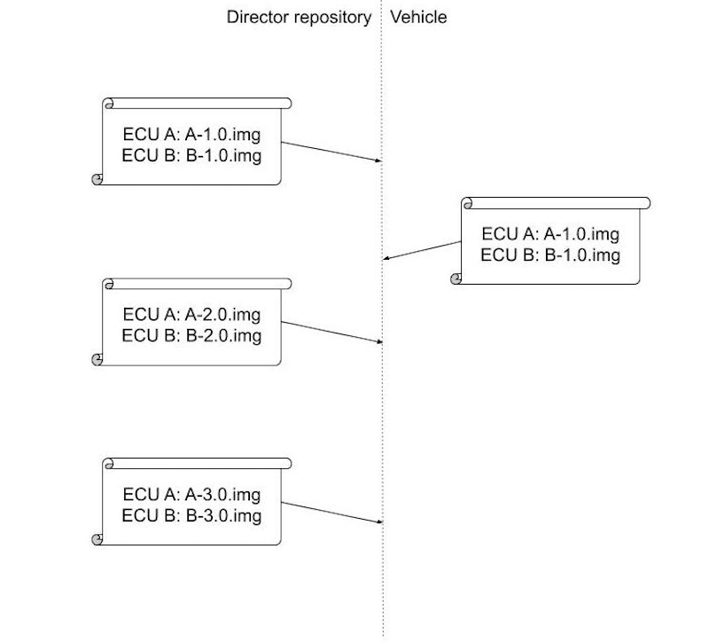

**Figure 1.** _A series of hypothetical exchanges between a Director repository and a vehicle._

Consider the series of messages exchanged between a Director repository and a vehicle in Figure 1.

- In the first bundle of updates, the Director repository instructs ECUs A and B to install the images A-1.0.img and B-1.0.img, respectively. Later, the vehicle sends a vehicle version manifest stating that these ECUs have now installed these images.
- In the second bundle, the Director repository instructs these ECUs to install the images A-2.0.img and B-2.0.img, respectively. However, for some unknown reason, the vehicle does not send a new vehicle version manifest in response.
- In the third bundle of updates, the Director repository instructs these ECUs to install the images A-3.0.img and B-3.0.img. However, it has not received a new vehicle version manifest from the vehicle stating that both ECUs have installed the second bundle. Furthermore, the Director repository knows that B-1.0 and C-3.0 conflict with each other. The only thing the Director repository can be certain of is that B has installed either B-1.0 or B-2.0, and C has installed either C-1.0 or C-2.0. Thus, the Director repository SHOULD NOT send the third bundle to the vehicle, because B-1.0 from the first bundle may still be installed, which would conflict with C-3.0 from the third bundle.
- Therefore, the Director repository SHOULD NOT issue the third bundle until it has received a vehicle version manifest from the vehicle that confirms that ECUs B and C have installed the second bundle, which is known to contain images that do not conflict with the third bundle.
- In conclusion, the Director repository SHOULD NOT issue a new bundle until it has received confirmation via the vehicle version manifest that no image known to have been installed conflicts with the new images in the new bundle.

If the Director repository is not able to update a vehicle for any reason, then it SHOULD raise the issue to the OEM.

### 8.0.7 ASN.1 decoding

If an OEM chooses to use ASN.1 to encode and decode metadata and other messages, then it SHOULD take great care in decoding the ASN.1 messages. Improper decoding of ASN.1 messages may lead to arbitrary code execution or denial-of-service attacks. For example, see [CVE-2016-2108](https://cve.mitre.org/cgi-bin/cvename.cgi?name=CVE-2016-2108) and attacks on a [well-known ASN.1 compiler](https://arstechnica.com/information-technology/2016/07/software-flaw-puts-mobile-phones-and-networks-at-risk-of-complete-takeover/).

In order to avoid these problems, whenever possible OEMs and suppliers SHOULD use ASN.1 decoders that have been comprehensively tested via unit tests and fuzzing.

Furthermore, following best practices, we recommend that DER encoding is used instead of BER and CER, because DER provides a unique encoding of values.

### 8.0.8 Balancing EEPROM performance and security

Many ECUs use EEPROM which, practically speaking, can be written to only a limited number of times. This in turn can impose limits on how often these ECUs can be updated.

In order to analyze this problem, let us recap what new information should be downloaded in every software update cycle:

1.  The Primary writes and sends the latest vehicle version manifest to the Director repository.
2.  All ECUs download, verify, and write the latest downloaded time from its source of current accurate time.
3.  All ECUs download, verify, and write metadata from the Director and/or Image repositories.
4.  At some point, ECUs download, verify, and write images.
5.  At some point, ECUs install new images. Then, they sign, and write the latest ECU version reports.

Let us make two important observations.

First, it is not necessary to continually refresh the time apart from a software update cycle. This is because: (1) the time may not be successfully updated, (2) an ECU SHOULD be able to boot to a valid image, even if its metadata has expired, and (3) it is necessary to check only that the metadata for the latest downloaded updates has not expired.

Indeed, there is a risk to implementers updating time information too frequently. For example, if time information is made once per day, it can cause flash devices with 10K write lifetime to wear out within roughly 27 years. If valid time metadata is always written to the same block, an admittedly unlikely scenario since the old metadata is likely to be retained before the new metadata is validated, this may cause unacceptable wear. Implementers should seriously consider both the lifetime usage of their devices and their likely update patterns if using technologies with limited writes.

However, there is a trade-off between frequently updating the current time (and thus, exhausting EEPROM), and the efficacy of the system to prevent freeze attacks from a compromised Director repository. If it is essential to frequently update the time to prevent freeze attacks, and EEPROM must be used, there are ways to make that use more efficient. For example, the ECU may write data to EEPROM in a circular fashion that can expand its lifetime of wear.

Second, it is not necessary for ECUs to write and sign an ECU version report upon every boot or reboot cycle. At a minimum, an ECU should write and sign a new ECU version report only upon the successful verification and installation of a new image.

### 8.0.9 Balancing security and bandwidth

When deploying any system, it is important to think about the costs involved. Those can roughly be partitioned into computational, network (bandwidth), and storage. This subsection gives a rough sense of how those costs may vary depending upon the deployment scenario employed. The numbers quoted are not authoritative, but do express order of magnitude costs.

A Primary will end up retrieving and verifying any updated metadata from the repositories it communicates with, which usually means an Image repository and a Director repository will be contacted. Whenever an image is added to the Image repository, a Primary will download a new Targets, Snapshot, and Timestamp metadata file. The Root file is updated less frequently, but when this is done, it may also need to be verified. Verifying these repositories and roles entails checking a signature on each of the files. Whenever the vehicle is requested to install an update, the Primary also receives a new piece of metadata for the Targets, Snapshot, and Timestamp roles, and on rare occasions, from the Root file. As noted above, this verification requires a signature check. A Primary must also compute the secure hash of all images it will serve to ECUs. The previous known good version of all metadata files must be retained. It is also wise to retain any images until Secondaries have confirmed installation.

A full verification Secondary is nearly identical in cost to a Primary. The biggest difference is that it has no need to store, retrieve, or verify an image that it is not destined to receive. However, other costs are fundamentally the same.

A partial verification Secondary merely retrieves Targets metadata when it changes, and any images it will install. This requires one signature check and one secure hash operation per software installation.

Note also that, if used, an external source of time costs are typically for one signature verification per ECU per time period of update (e.g., daily). This cost varies based upon the algorithm and thus its measurement can only be estimated based upon the algorithm.

### 8.0.10 Using encrypted images on the Image repository

Images stored on the Image repository may have previously been encrypted or not, at the discretion of the implementer. The Standard does not explicitly mention using encrypted images on the Image repository because Uptane treats these blobs exactly the same as unencrypted blobs. It only imposes special requirements on images that are per-ECU encrypted on the Director repository. Therefore, there is no reason that encrypted images cannot be on the Image repository should an implementer wish to use them.

### 8.0.11 Avoiding Director replay attacks

Uptane doesn’t explicitly require that Targets metadata from the Director contain any images at all.

As such, it may be tempting to only include software images that need to be updated in a Director’s Targets metadata, for efficiency and bandwidth-minimization reasons. Yet, such an action implies that empty Targets metadata would be sent if no updates are available. Sending empty Targets metadata with only the required fields presents a potential security threat. As empty metadata does not include any ECU- or vehicle-specific information, it could potentially be replayed to another vehicle, creating a “freeze” attack, since the targeted vehicle would continue to believe it was fully updated. (See [uptane-standard issue #202](https://github.com/uptane/uptane-standard/issues/202) for a more detailed discussion.)

There are two straightforward mitigations for this issue:

- Don’t allow the Director to issue empty Targets metadata. For example, you could always include the image installed on the Primary ECU. This mitigation requires no client-side changes.
- Include the targeted VIN number (or some other vehicle identifier) in the Director Targets metadata. We recommend using a top-level “vin” or “device_id” field for this purpose. The client should then add a verification step checking that the VIN matches its own. If there is a mismatch, the client should abort the update cycle and report an error.

The latter mitigation will likely be included as a requirement in a future release of the Uptane standard.

## 9 Frequently asked questions

### 9.0.1 **What makes Uptane different from other SOTA security mechanisms?**

Security problems can occur due to accidental disclosures, malicious attacks, or disgruntled insiders. It is not a matter of whether a successful attack will occur, but when. Because of the very real threat of a compromise, a security system must be able to securely recover from an attack. This means that an update system must have a way to restore its operations in a timely fashion when a key is lost or compromised.

For example, suppose a nation-state actor steals a signing key and wants to use it to distribute software. Something similar happened in the 2011 [DigiNotar](https://en.wikipedia.org/wiki/DigiNotar) case, widely attributed to the Iranian government, in which 300,000 Iranian Gmail users were the main targets of a hack against the Dutch company. Following such an attack, a secure update system must provide a way to revoke the current trusted information, even if the adversary is able to be a man-in-the-middle for future communications. Uptane is designed to provide strong security in cases like these by making sure failures are compartmentalized and limited in scope.

No other automotive-grade update system has been designed to work in such rigorous situations or has received more public scrutiny than Uptane. We follow best practices in the security community by opening our design to wide-scale, public review. This has proven essential time and time again to ensure a design will hold up against attackers, especially those as strong as nation-state actors. Furthermore, Uptane’s design is heavily influenced by the design of [TUF](https://theupdateframework.io/), a widely used software update system with a strong track record of usability and security across millions of devices. As a free and open standard, with no cost to use or adopt, Uptane stands alone in the automotive update space.

### 9.0.2 **How does Uptane work with other systems and protocols?**

Other mechanisms for performing updates, such as those offered by Red Bend, Movimento, and Tesla, are compatible with Uptane solely for handling data transport. Uptane can use any transport mechanism, and still provide strong security guarantees, even if the underlying network or transport mechanism is compromised. If a manufacturer wants to move to a secure update system, keeping their existing system as a transport mechanism for Uptane is an effective way to do so. See the [Customizing Uptane](https://uptane.github.io/deployment-considerations/customizations.html) section of this document.

### 9.0.3 **What are the cost implications of integrating Uptane?**

A number of factors can influence the costs involved with implementing Uptane. If a project is starting from scratch, the cost would be minimal and any money spent would be just one component of the initial design. For existing OTA systems, the choice will be to either buy an off-the-shelf solution and do an integration, or to build a custom solution, with some greater or smaller degree of reliance on available open-source client and server components. There are pros and cons to both options, but ultimately, the issue of cost cannot be determined without also considering the value received for the expense. Value in this case is enhanced security, so when discussing costs, the trade-off between taking shortcuts and sacrificing security, or doing it right and spending more time/money, must be considered. A more detailed discussion on this issue can be found in the [Setting up Uptane repositories](https://uptane.github.io/deployment-considerations/repositories.html) section.

### 9.0.4 **Must all signatures be valid for a threshold of signatures to be valid?**

The threshold requirement of Uptane, mentioned in [Section 5.4.4.3](https://uptane.github.io/uptane-standard/uptane-standard.html#check_root) and in descriptions of other roles, stipulates that a set number of keys are required to sign a metadata file. This is designed to prevent attacks by requiring would-be hackers to compromise multiple keys in order to install malware. However, what happens if this threshold is met, but one or more of the keys is not valid?

The Uptane Standard allows each implementer to decide whether these keys would be accepted. Take the following example:

Root metadata lists valid top-level Targets key identifiers are A, B, C, and D, with a threshold of 2. Should the following two metadata files be considered valid?

- Signed by A, B, and X, where X is not present at all in Root metadata
- Signed by A, B, and C, but B’s signature doesn’t actually match the signed content

The first case can happen when you include X in a newer version of Root metadata (for example the next iteration), so this has to be handled correctly or it will complicate the process of adding and rotating keys. The second case could happen when you are changing or adding signing algorithms. This case can occur if B is using a new signing scheme that the client currently does not understand, but will know how to parse after the update.

Both the Uptane Standard and the Reference Implementation consider both of these cases valid, and the implementation also includes unit tests to verify this behavior.

We would welcome input from the community as to whether a case can be made for specifying one option over another.

## 10 Changelog

All notable changes to this project will be documented in this file.

The format is based on [Keep a Changelog](https://keepachangelog.com/en/1.0.0/), and this project adheres to [Semantic Versioning](https://semver.org/spec/v2.0.0.html).

## 10.1 \[Unreleased\]

## 10.2 \[2.0.0\] - 2022-01-18

As the first major release since 1.0.0 was issued on July 31, 2019, the new version contains several breaking changes that could affect backwards compatibility. However, several of these changes also provide greater flexibility for the implementer. Probably the most significant change was removing references to the Uptane Time Server, to clarify that users can make their own decisions about secure sources of time, as long as it is reliable. On the whole, V.2.0.0 should make implementation on legacy systems easier rather than more complex.

### 10.2.1 Added

- The actual RFC 2119 definitions to the Standard, and a statement of caution about the use of imperatives in that document. The definitions to terms MUST and MUST NOT are excluded in keeping with the decision to only use the terms SHALL or SHALL NOT when referring to actions in the Standard that mandate compliance.
- A note restricting the use of imperatives to instances where they are actually required for interoperation or to limit behavior which has potential for causing harm.
- A qualifying note distinguishing between signing keys and secret keys used to decrypt images. The former are required to be unique to the ECU to avoid replay attacks, but the latter need not be unique.
- A recommendation that filenames of images SHOULD be encoded to prevent a path traversal on the client system, either by using URL encoding or by limiting the allowed character set in the filename.

### 10.2.2 Changed

- Policy on when changes to the Standard become “official” by adding the following statement to the Standard repository, “As the Standard is a living document, updates are made in real time as needed. However, these changes will not be considered formally adopted until the release of the next minor or major version.”
- The wording used to refer to actions in the Standard that require compliance from a mix of SHALL and MUST to just SHALL. Previously, the two words were used interchangeably in the document. However, in other contexts, there are subtle differences in the meaning of these words. By consistently using just SHALL, it reduces any possible confusion.
- The stipulation in Section 5.4 that ECUs monitor the download speed of image metadata and image binaries to detect and respond to a slow retrieval attack from a SHOULD to a SHALL.
- The stipulation in Section 5.4.3.4 that ECUs check that the length of the image matches the length listed in the metadata from a SHOULD to a SHALL.
- The description of the relationship between Primaries and Secondaries if a vehicle has multiple Primaries. It is now described this way: “If multiple such Primaries are included within a vehicle, each Primary SHOULD have a designated set of Secondaries.”
- The stipulation in Section 5.2.3.1 that a vehicle identifier be used in a situation where Targets metadata from the Director repository include no images from a SHOULD to a SHALL. The stronger compliance word is needed to prevent replay attacks.

### 10.2.3 Removed

- All references to the Uptane Time Server. While having a secure source of time is still mandated as a requirement for compliance, we are no longer recommending the Uptane Time Server as that source. Several other time source options are discussed in the [“Setting up Uptane Repositories” section of Deployment Best Practices](https://uptane.github.io/deployment-considerations/repositories.html).

## 10.3 \[1.2.0\] - 2021-07-16

As this is the second minor release issued in 2021, the short list of changes made to the Uptane Standard between January 8 and July 2 of this year were primarily wordsmithing corrections to improve clarity.

### 10.3.1 Added

- A “SHOULD” requirement to the Standard that recommends including vehicle identifiers to targets metadata in order to avoid replay attacks. The sentence “Targets metadata from the Director repository SHOULD include a vehicle identifier if there are no images included in the targets metadata” was added to Section 5.2.3.1.
- The word “unique” wherever the Standard mentions key thresholds. This is to clarify that multiple signatures from the same key do not count as a threshold.

### 10.3.2 Changed

- The location of the “Terminology” section. All definitions have been moved to the Glossary section of the Deployment Best Practices document.

### 10.3.3 Removed

- The use of the phrase “secondary storage,” because this usage was very unclear. Instead, the Standard now refers to secondaries with “limited storage to receive an image.”

## 10.4 \[1.1.0\] - 2021-01-08

The changes made to the Uptane Standard since its initial release on July 31, 2019, have principally addressed issues of style, clarity, and the resolution of inconsistencies. As a result, the majority of text edits and additions seek to correct wording in the original text that could potentially be misleading.

### 10.4.1 Added

- A style guide to impose consistency in spelling, capitalization of roles and repository names, and use of punctuation.
- A policy for how to link to the Standard or any specific portion of it. Any links to the Standard from other documents should point to the latest released version, and should link by section name, not number, as the numbers tend to change more than the names.
- A document archive policy to add a stable copy of each version of the Standard to the repository, starting with the initial IEEE/ISTO V.1.0.0 document.
- A new entry to the list of what is “Out of scope” for the Standard: “Compromise of the packaged software, such as malware embedded in a trusted package.”
- The option to use a counter (instead of a nonce) in the ECU Version Report, and the purpose of the nonce in the step-by-step instructions for preparing this report.
- A clarification that metadata is required at manufacturing time, and a rationale for why preinstalled metadata is needed. This step enables an ECU to authenticate that a remote repository is legitimate when it first downloads metadata in the field, which can serve as a defense against rollback attacks.
- A clarification that there is no need to download all metadata from the Image repo if the Director indicates there are no new updates to install.
- A clarification about the manner in which we identify images by their hash. It specifies that if the Primary has received multiple hashes for a given image binary via the Targets role, then it SHALL verify every hash for this image. This step is to be performed even if the image is identified by a single hash as part of its filename.
- A clarification that full verification MUST be performed by Primary ECUs and MAY be performed by Secondary ECUs.
- A missing reference to the Standard pointing to the Time Server description in _Uptane Deployment Best Practices._

### 10.4.2 Changed

- The name of our deployment considerations document. It is now _Uptane Deployment Best Practices_ to better reflect naming conventions within the community.
- The way steps are referenced in the ECU process for verifying the latest downloaded metadata.
- Several numbering references in the full verification process, and “Step 0” in the procedure for checking Root metadata.
- Moved a Targets metadata check for unrecognized ECU IDs to a more logical place in the series of checks.
- Resolved an inconsistency in how checking hashes of images is discussed.
- Aligned naming of example hashes with [NIST policy](https://csrc.nist.gov/projects/hash-functions/nist-policy-on-hash-functions) on hash functions. This change was also made to demonstrate that Uptane is not tied to any particular set of algorithms.
- Specified that the ECU SHOULD check that the length of the image matches the length listed in the metadata in the procedure for checking hashes.
- Modified wording to make verifying a time message optional if the ECU does not have the capacity to do so.
- Replaced phrases that were incorrect, or could be mistaken for another object or function. These included the phrases _target metadata,_ _image metadata,_ _ECU version manifest,_ and _Uptane Standards_ (plural, instead of singular).
- Corrected additional capitalization and punctuation usages for consistency, including imposing the consistent use of the Oxford comma in a series of items within a sentence, and placing a comma after e.g. and i.e.
- Corrected other stylistic/formatting issues that interfered with clarity, such as extraneous commas and use of whitespace.
- Replaced phrases that were incorrect, or could be mistaken for another object or function. These included the phrases _target metadata,_ _image metadata,_ _ECU version manifest,_ and _Uptane Standards_ (plural, instead of singular).
- Switched a MAY to a SHOULD in the statement “Full verification MUST be performed by Primary ECUs and SHOULD be performed by Secondary ECUs,” to be consistent with references elsewhere in the Standard.
- Credited the document’s authorship to the Uptane Community, and changed the organization name from the Uptane Alliance to Joint Development Foundation Projects, LLC, Uptane Series.

### 10.4.3 Removed

- Removed words from the opening definition section that are not used in the Standard.
- Removed references to TAP 5 in three places in the Standard. TAP 5 has been more or less replaced by TAP 13, but the latter has not yet been approved.
